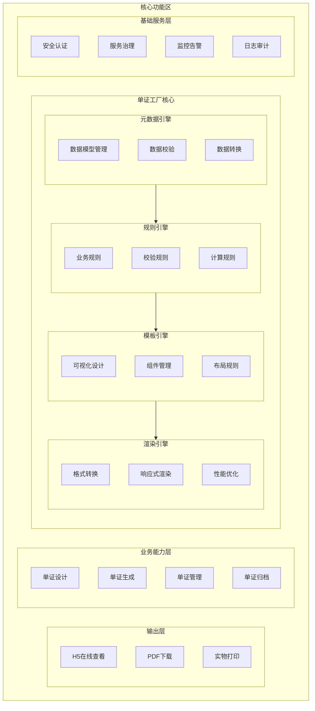
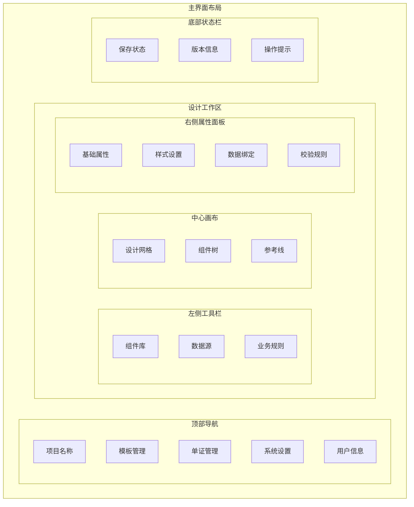

# 1. 单证工厂方案设计——农险为例

## 1.1 项目概述

### 1.1.1 背景说明
- 保险单证电子化是行业发展趋势
- 监管要求持续提高合规性
- 业务创新需要更灵活的单证支持

### 1.1.2 当前痛点
- 电子单证生成高度依赖人工开发
- 不同险种和合作机构的个性化要求差异大
- 每次新增场景需重新编码，成本高效率低

### 1.1.3 建设目标
- 实现单证配置化生成
- 提升单证开发效率
- 降低运维成本
- 确保合规合法

---

## 1.2 市场分析

### 1.2.1 行业现状
- 单证电子化成为趋势
  - 保单线上化率超过80%
  - 移动化服务需求增长
  - 场景定制化明显

- 主流技术路线
  - 传统模板引擎：成熟稳定,扩展性差
  - 低代码平台：灵活性强,学习成本高
  - Schema驱动：标准化强,落地难度大

### 1.2.2 产品对比分析

#### 1.2.2.1 单证配置能力对比
| 能力维度 | 东软IDMS | 平安智能单证 | 众安无界山 |
|---------|---------|------------|-----------|
| 模板设计能力 | - 表单化配置<br>- 固定组件库<br>- 静态布局 | - 可视化设计<br>- 自定义组件<br>- 响应式布局 | - Schema驱动<br>- 组件市场<br>- 智能布局 |
| 数据处理能力 | - 基础字段校验<br>- 简单数据转换<br>- 单一数据源 | - 业务规则引擎<br>- 多维度计算<br>- 多源数据整合 | - 实时计算引擎<br>- AI数据处理<br>- 开放数据接口 |
| 业务适配能力 | - 传统险种支持<br>- 标准化场景<br>- 本地化部署 | - 全险种覆盖<br>- 场景化定制<br>- 混合云部署 | - 互联网险种<br>- 敏捷化创新<br>- 云原生架构 |
| 运营效率 | - 开发周期2-3周<br>- 人工成本高<br>- 复用率低 | - 开发周期3-5天<br>- 运营成本中<br>- 复用率中 | - 开发周期1-2天<br>- 运营成本低<br>- 复用率高 |
| 集成成本 | - 授权费100w+<br>- 定制费30w+/年<br>- 维护费15w+/年 | - 授权费500w+<br>- 定制费50w+/年<br>- 维护费30w+/年 | - 服务费200w+/年<br>- 按量计费<br>- 零维护成本 |

#### 1.2.2.2 产品特性详细对比

1. **东软IDMS**
   - 产品定位：传统保险公司单证管理系统
   - 技术特点：
     - 基于.NET架构
     - 单体应用设计
     - 本地化部署
   - 优势：
     - 保险业务经验丰富
     - 稳定性和可靠性高
     - 合规性保障强
   - 不足：
     - 技术架构老旧
     - 扩展能力受限
     - 创新支持不足

2. **平安智能单证**
   - 产品定位：企业级单证智能化平台
   - 技术特点：
     - 微服务架构
     - 容器化部署
     - 分布式设计
   - 优势：
     - 全场景业务覆盖
     - 丰富的组件库
     - 强大的规则引擎
   - 不足：
     - 实施周期长
     - 成本投入大
     - 学习曲线陡

3. **众安无界山**
   - 产品定位：互联网保险科技平台
   - 技术特点：
     - 云原生架构
     - 服务网格
     - Serverless
   - 优势：
     - 极致的用户体验
     - 快速迭代能力
     - 智能化程度高
   - 不足：
     - 传统场景支持弱
     - 私有化部署难
     - 成本预测难

#### 1.2.2.3 建议方案

基于农险业务特点和投资收益分析，建议采用"智能配置+低代码"混合模式：

1. **整体架构**
   - 智能配置引擎：核心单证处理
   - 低代码平台：特殊场景定制
   - 开放接口：生态对接扩展

2. **实施策略**
   - 第一阶段：核心引擎研发(6个月)
   - 第二阶段：场景化扩展(3个月)
   - 第三阶段：生态化演进(持续)


---

## 1.3 单证工厂项目设计

### 1.3.1 单证工厂整体架构



### 1.3.2 核心引擎设计

#### 1.3.2.1 元数据引擎
- **数据模型管理**
  - 标准化数据结构定义
  - 字段映射规则维护
  - 数据依赖关系处理
- **数据校验**
  - 字段格式校验
  - 数据完整性检查
  - 业务规则验证

#### 1.3.2.2 规则引擎
- **业务规则处理**
  - 条件判断规则
  - 计算公式规则
  - 显示控制规则
- **规则链管理**
  - 规则优先级设置
  - 规则冲突处理
  - 规则版本控制

#### 1.3.2.3 模板引擎
- **模板设计**
  - 可视化设计工具
  - 组件库管理
  - 布局规则配置
- **模板管理**
  - 模板版本控制
  - 模板复用机制
  - 模板权限管理

#### 1.3.2.4 渲染引擎
- **渲染处理**
  - 多格式支持（PDF/HTML/Word）
  - 响应式布局适配
  - 批量渲染优化
- **性能优化**
  - 渲染缓存
  - 分布式处理
  - 异步渲染

### 1.3.3 全流程管控
- **设计阶段**：通过模板设计器完成单证布局和数据映射
- **生成/印制阶段**：支持电子单证实时生成和实物单证批量印制
- **发放阶段**：实现线上线下单证统一发放管理
- **使用阶段**：提供电子签名、流转追踪等功能
- **回收阶段**：支持作废、核销等处理
- **归档阶段**：统一存储并提供检索服务

1. **单证设计管理**
   - 农险专属模板库（种植险/养殖险/森林险）
   - 监管要求预置（三农业务合规要点）
   - 多层级审核流程

2. **实物单证管理**
   - 印刷管理：申请、招标、验收
   - 库存管理：入库、盘点、调拨
   - 发放管理：授权、限额、登记
   - 回收管理：记录、核销、存档

3. **电子单证管理**
   - 在线生成：批量/实时
   - 电子签章：农户签名/公司签章
   - 区块链存证：防篡改/可追溯
   - 在线归档：分类/检索/导出

---

## 1.4 核心功能设计

### 1.4.1 数据管理方案

#### 1.4.1.1 数据模型标准化
- **农险数据标准化**
  - 基础信息：农户信息、土地信息、种植信息
  - 业务信息：保单信息、验标信息、理赔信息
  - 扩展信息：气象数据、产量数据、补贴信息

#### 1.4.1.2 数据处理增强
1. **数据依赖关系处理**
```javascript
{
  "字段计算规则": {
    "总保费": {
      "依赖字段": ["主险保费", "附加险保费"],
      "计算公式": "sum(主险保费,附加险保费)"
    },
    "农险赔付金额": {
      "依赖字段": ["受灾面积", "单位赔付标准"],
      "计算公式": "multiply(受灾面积,单位赔付标准)"
    }
  }
}
```

2. **动态数据展示规则**
```javascript
{
  "农户信息展示": {
    "数据源": "农户地块清单",
    "分组字段": "地块编号",
    "展示规则": {
      "按地块分页": true,
      "每页最大条数": 10,
      "自动分页": true
    }
  }
}
```

### 1.4.2 规则引擎方案

#### 1.4.2.1 规则配置
```javascript
{
  "业务规则": {
    "农险规则": {
      "条件": "insurance_type = 'agriculture'",
      "必填字段": ["disaster_type", "weather_alert"],
      "计算公式": {
        "赔付金额": "disaster_area * compensation_standard",
        "总保费": "sum(main_premium, additional_premium)"
      }
    }
  },
  "合规规则": {
    "监管要求": {
      "字体大小": ">=10pt",
      "签名位置": "must_exist",
      "条款说明": "must_exist"
    }
  }
}
```

### 1.4.3 模板引擎方案

#### 1.4.3.1 拖拽式设计器
1. **前端界面设计**


2. **组件结构设计**
```typescript
interface BaseComponent {
  id: string;
  type: ComponentType;
  position: Position;
  style: Style;
  dataBinding?: DataBinding;
  validators?: Validator[];
}

interface AgricultureComponent extends BaseComponent {
  bizType: 'farmer' | 'land' | 'crop';
  template: string;
  rules: BusinessRule[];
}

interface ComponentTree {
  root: BaseComponent;
  children: ComponentTree[];
  layout: 'flow' | 'grid' | 'absolute';
}
```

#### 1.4.3.2 模板方案对比
| 方案类型 | 适用场景 | 优势 | 劣势 | 建议 |
|---------|---------|------|------|------|
| 拖拽式设计器 | 简单单证设计,运营人员使用 | 直观易用,所见即所得 | 灵活度受限,难以处理复杂布局 | 作为主要设计方式 |
| JSON Schema | 复杂数据模型,开发人员使用 | 结构化强,可编程性好 | 学习成本高,不直观 | 作为高级设计模式 |
| Excel转换 | 存量单证迁移,模板复用 | 快速转换,适合批量 | 精确度有限,需人工调整 | 作为辅助迁移工具 |

#### 1.4.3.3 智能转换功能
1. **OCR智能识别**
   - 支持Excel/PDF/扫描件识别
   - 智能分析布局和样式
   - 自动提取文本和表格

2. **组件智能映射**
   - 基于规则的组件识别
   - 智能布局优化建议
   - 样式自动补全

3. **数据绑定助手**
   - 字段智能匹配
   - 数据类型推断
   - 校验规则建议

---

## 1.5 数据处理设计

### 1.5.1 数据模型标准化
- **基础信息**：保单信息、验标信息、理赔信息
- **扩展信息**：气象数据、产量数据、补贴信息

### 1.5.2 数据自动获取
- 农业农村部：土地确权、种植面积
- 气象部门：灾害预警、降水量
- 农技部门：作物长势、病虫害

---

## 1.6 系统能力

### 1.6.1 核心能力矩阵
| 能力分类 | 具体功能 | 技术特点 |
|---------|---------|----------|
| 基础能力 | 模板管理、数据处理、规则计算、渲染输出 | 微服务架构、分布式缓存 |
| 扩展能力 | 三方集成、签章服务、存证服务、监控告警 | 开放API、插件机制 |
| 管理能力 | 版本控制、灰度发布、监控告警、审计日志 | DevOps支持、容器化部署 |

---

## 1.7 实施路径

### 1.7.1 分步实施
1. MVP验证：从种植险单证切入
2. 能力扩展：养殖险、森林险覆盖
3. 生态构建：实现全险种

### 1.7.2 效果评估
| 维度 | 优化前 | 优化后 |
|------|--------|--------|
| 开发周期 | 2-3周/单证 | <1天/单证 |
| 人工成本 | 60%+ | <20% |
| 单证丢失率 | 5% | <0.1% |
| 追溯时间 | 数小时 | 秒级 |

---

## 1.8 总结与展望

### 1.8.1 方案价值
- 提升业务响应速度
- 降低技术开发成本
- 保证合规性要求

### 1.8.2 后续规划
- 持续优化性能
- 扩展业务场景
- 构建开放生态