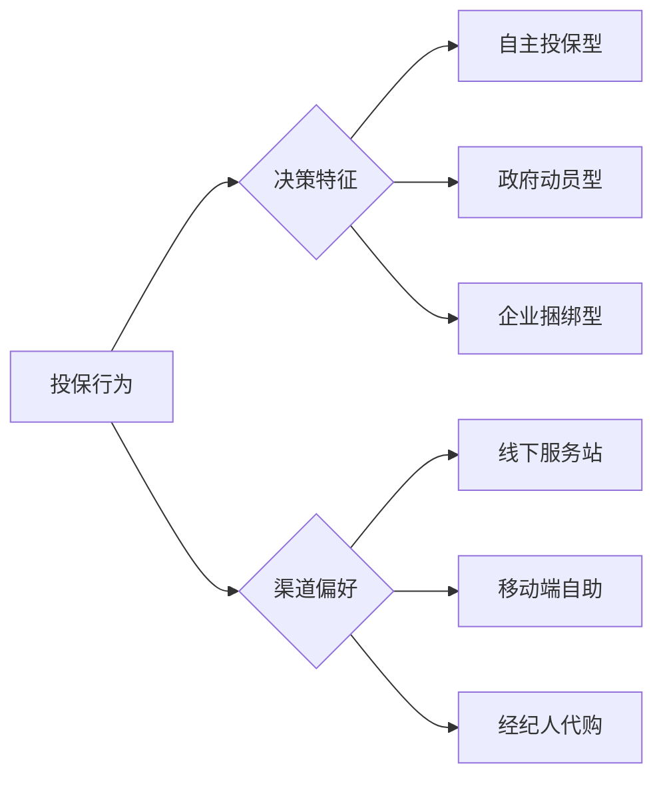
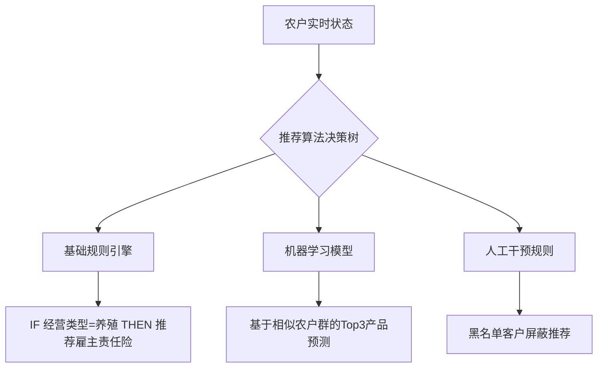

---

## **农户用户画像分析维度**
### 1. **基础属性画像**
| 维度              | 分类标准                          | 具体取值示例               | 应用场景示例                  |
|-------------------|-----------------------------------|--------------------------|----------------------------|
| **年龄段**        | 35岁以下/35-50岁/50-65岁/65岁以上 | 35岁以下                 | 定制不同期限保障方案         |
| **性别**          | 男/女                             | 男                      | 差异化营销策略设计           |
| **教育程度**      | 初中及以下/高中/大专及以上        | 高中                    | 产品解释难度分级             |
| **地理属性**      | 省份/城市/乡镇/地形（平原/山区）  | 浙江省杭州市萧山区长河镇   | 匹配区域特色产品（如茶叶险） |
| **家庭结构**      | 劳动力数量/老人儿童占比           | 2劳动力/1老人/1儿童      | 推荐医疗/教育金保险          |
| **收入层级**      | 年收入（<5万/5-20万/20万+）       | 15万                    | 区分基础/高端产品推荐        |
| **是否贫困户态**      | 是/否                             | 是                      | 政策补贴优惠资格             |
| **农业主体类型**  | 个体农户/家庭农场/农民专业合作社  | 家庭农场                 | 差异化承保方案               |

### 2. **经营特征画像**

*图1：经营类型与规模分布矩阵分析*

| 维度                | 细分标准                          | 数据来源                    |
|--------------------|-----------------------------------|----------------------------|
| **经营类型**        | 种植（粮食/经济作物）/养殖/混合   | 农业部门登记数据            |
| **经营规模**        | 土地面积（亩）/牲畜头数/年产值    | 卫星遥感/物联网设备         |
| **产业链位置**      | 生产端/加工端/销售端              | 经营许可证信息              |
| **产品细类**        | 种植险/养殖险/林业险              | 保单系统数据                |
| **业务种类**        | 中央政策性/地方政策性/商业性      | 承保政策文件                |
| **保障类型**        | 直接物化成本/收入保障/设施设备    | 保单条款                    |
| **投保标的特征**    | 标的类型/数量/单位价值            | 承保清单                    |
| **保费属性**        | 自缴保费/总保额/补贴比例          | 保费计算单                  |

### 3. **风险特征画像**
| 风险维度        | 评估指标                          | 高风险特征示例            |
|-----------------|-----------------------------------|--------------------------|
| **自然风险**    | 近3年受灾频率/最大损失金额        | 位于洪水多发区           |
| **市场风险**    | 产品价格波动率/销售渠道集中度     | 单一收购商依赖           |
| **经营风险**    | 负债率/设备老旧程度               | 农机使用超8年           |

### 4. **消费行为画像**


---
---

## **产品关联推荐引擎设计**
### 1. **关联规则应用场景**
| 触发条件                | 推荐逻辑                      | 示例产品组合                |
|-------------------------|-----------------------------|---------------------------|
| 新投保水稻种植险        | 同场景延伸                  | 暴雨指数保险+仓储财产险    |
| 养殖险续保第3年         | 产业链延伸                  | 运输险+农产品质量责任险    |
| 家庭年收入突破20万元    | 消费升级推动                | 教育年金险+高端医疗险      |

### 2. **智能推荐机制**


### 3. **推荐效果评估矩阵**
| 评估维度        | 核心指标                  | 行业基准值  |
|-----------------|---------------------------|------------|
| 精准度          | 点击转化率                | ≥12%       |
| 商业价值        | 推荐客单价提升幅度         | ≥25%       |
| 风险控制        | 推荐后投诉率              | <0.5%      |

---
---

## **附录**
### 交付物清单
1. 《农户360°画像标签字典》  
2. 《保单分层运营策略手册》  
3. 《智能推荐系统操作指南》  
4. 《数据分析看板配置说明》  

### 文档价值点
- 实现从**保单分析**到**用户洞察**的闭环  
- 建立**静态特征**与**动态行为**的双轨决策机制  
- 提供可落地的**策略-数据-系统**一体化方案"## **分析背景与目标**
### 1. 背景  
- **政策驱动**：农业保险补贴政策持续加码，覆盖率快速提升  
- **市场空白**：农户非农险渗透率不足20%，存在交叉销售机会  
- **需求升级**：新型农业主体（家庭农场、合作社）出现综合金融需求  

### 2. 目标  
- 构建多维度农户画像体系  
- 识别保单持有结构及在保状态分层  
- 挖掘农险与非农险关联规律，设计精准推荐策略  

---

## **农户用户画像分析维度**
### 1. **基础属性画像**
| 维度              | 分类标准                          | 具体取值示例               | 应用场景示例                  |
|-------------------|-----------------------------------|--------------------------|----------------------------|
| **年龄段**        | 35岁以下/35-50岁/50-65岁/65岁以上 | 35岁以下                 | 定制不同期限保障方案         |
| **性别**          | 男/女                             | 男                      | 差异化营销策略设计           |
| **教育程度**      | 初中及以下/高中/大专及以上        | 高中                    | 产品解释难度分级             |
| **地理属性**      | 省份/城市/乡镇/地形（平原/山区）  | 浙江省杭州市萧山区长河镇   | 匹配区域特色产品（如茶叶险） |
| **家庭结构**      | 劳动力数量/老人儿童占比           | 2劳动力/1老人/1儿童      | 推荐医疗/教育金保险          |
| **收入层级**      | 年收入（<5万/5-20万/20万+）       | 15万                    | 区分基础/高端产品推荐        |
| **是否贫困户态**      | 是/否                             | 是                      | 政策补贴优惠资格             |
| **农业主体类型**  | 个体农户/家庭农场/农民专业合作社  | 家庭农场                 | 差异化承保方案               |

### 2. **经营特征画像**

*图1：经营类型与规模分布矩阵分析*

| 维度                | 细分标准                          | 数据来源                    |
|--------------------|-----------------------------------|----------------------------|
| **经营类型**        | 种植（粮食/经济作物）/养殖/混合   | 农业部门登记数据            |
| **经营规模**        | 土地面积（亩）/牲畜头数/年产值    | 卫星遥感/物联网设备         |
| **产业链位置**      | 生产端/加工端/销售端              | 经营许可证信息              |
| **产品细类**        | 种植险/养殖险/林业险              | 保单系统数据                |
| **业务种类**        | 中央政策性/地方政策性/商业性      | 承保政策文件                |
| **保障类型**        | 直接物化成本/收入保障/设施设备    | 保单条款                    |
| **投保标的特征**    | 标的类型/数量/单位价值            | 承保清单                    |
| **保费属性**        | 自缴保费/总保额/补贴比例          | 保费计算单                  |

### 3. **风险特征画像**
| 风险维度        | 评估指标                          | 高风险特征示例            |
|-----------------|-----------------------------------|--------------------------|
| **自然风险**    | 近3年受灾频率/最大损失金额        | 位于洪水多发区           |
| **市场风险**    | 产品价格波动率/销售渠道集中度     | 单一收购商依赖           |
| **经营风险**    | 负债率/设备老旧程度               | 农机使用超8年           |

### 4. **消费行为画像**


---

## **保单分层分析框架**
### 1. **农险特色分层模型**

*图2：农户保单分层模型示意图*

#### (1) **保单状态分层**
| 层级类型 | 定义标准                          | 运营重点                    |
|----------|-----------------------------------|---------------------------|
| 活跃在保 | 当前年度有效保单≥1份             | 产品扩面增保               |
| 即将到期 | 主要险种剩余有效期<60天          | 提前续保提醒               |
| 已脱保   | 所有保单失效超过30天             | 重点唤回挽留               |
| 从未投保 | 系统内无投保记录                 | 首单激活引导               |

#### (2) **保障组合分层**
| 组合类型 | 特征描述                          | 提升策略                    |
|----------|-----------------------------------|---------------------------|
| 单一保障 | 仅持有政策性农险                 | 推荐意外/财产等基础产品    |
| 基础组合 | 政策性农险+1个商业险种           | 交叉销售相关场景产品       |
| 综合保障 | 政策性农险+2个及以上商业险种     | 升级高端产品方案           |

#### (3) **价值分层及运营策略**
| 价值层级 | 画像特征                           | 差异化策略                 |
|----------|------------------------------------|-----------------------------|
| 钻石级   | 年保费>1万+全场景保障             | VIP服务+专属理赔通道       |
| 金级     | 年保费5000-1万+2个及以上险种      | 优先理赔+增值服务礼包      |
| 银级     | 年保费1000-5000+单一商业险        | 标准服务+节日关怀          |
| 铜级     | 仅投保政策性农险                  | 基础服务+产品教育          |

### 2. **动态分层监控看板**
| 指标                | 计算逻辑                          | 预警阈值  |
|---------------------|-----------------------------------|-----------|
| 脱保加速率          | 本月脱保户数/上月活跃户数         | >15%      |
| 产品扩散指数        | 平均每户持有产品数（农险+非农险） | <1.2      |
| 组合健康度          | 综合保障户占比/单农险户占比       | 目标≥1:3  |

---

## **产品关联推荐引擎设计**
### 1. **关联规则应用场景**
| 触发条件                | 推荐逻辑                      | 示例产品组合                |
|-------------------------|-----------------------------|---------------------------|
| 新投保水稻种植险        | 同场景延伸                  | 暴雨指数保险+仓储财产险    |
| 养殖险续保第3年         | 产业链延伸                  | 运输险+农产品质量责任险    |
| 家庭年收入突破20万元    | 消费升级推动                | 教育年金险+高端医疗险      |

### 2. **智能推荐机制**


### 3. **推荐效果评估矩阵**
| 评估维度        | 核心指标                  | 行业基准值  |
|-----------------|---------------------------|------------|
| 精准度          | 点击转化率                | ≥12%       |
| 商业价值        | 推荐客单价提升幅度         | ≥25%       |
| 风险控制        | 推荐后投诉率              | <0.5%      |

---

## **实施路线图**
### 1. 数据准备阶段（1-2周）
- **核心数据清单**：  
  ```markdown
  - [x] 农户基础信息库（含地理标签）
  - [ ] 物联网设备数据（需对接农业局）
  - [x] 历史保单全量数据
  - [ ] 第三方征信数据（需法务审核）
  ```

### 2. 模型开发阶段（3-4周）
- **关键里程碑**：  
  ```mermaid
  timeline
      2023-10 : 画像标签体系上线
      2023-11 : 分层模型V1.0完成验证
      2023-12 : 推荐引擎接入业务系统
  ```

### 3. 试点推广阶段（持续迭代）
- **AB测试设计**：  
  | 测试组   | 策略特征                  | 观测指标               |
  |----------|--------------------------|-----------------------|
  | 对照组   | 传统人工推荐              | 转化率9.2%            |
  | 实验组1  | 规则引擎推荐              | 转化率13.8%↑          |
  | 实验组2  | 规则+模型混合推荐         | 转化率17.1%↑↑         |

---

## **附录**
### 交付物清单
1. 《农户360°画像标签字典》  
2. 《保单分层运营策略手册》  
3. 《智能推荐系统操作指南》  
4. 《数据分析看板配置说明》  

### 文档价值点
- 实现从**保单分析**到**用户洞察**的闭环  
- 建立**静态特征**与**动态行为**的双轨决策机制  
- 提供可落地的**策略-数据-系统**一体化方案

