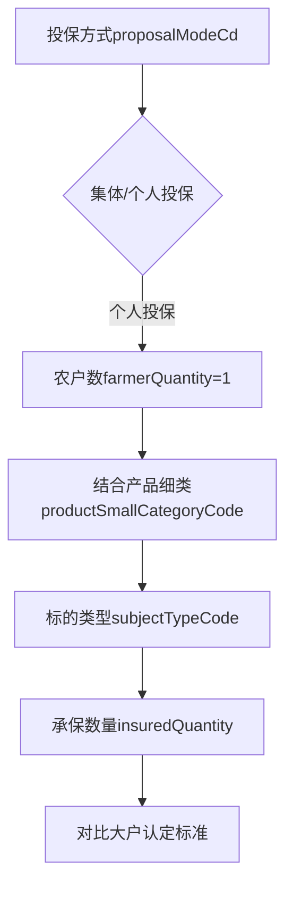
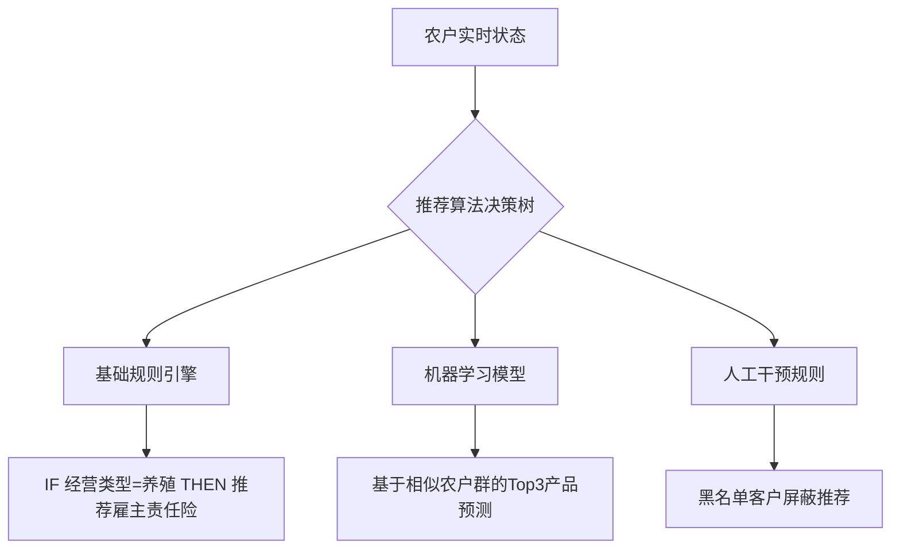

# 农户资产分析与保险产品匹配策略

## 一、摘要

本研究通过构建农户资产画像体系，对农户经济实力、风险特征进行多维度分析，建立资产价值评估模型，为农业保险产品的精准营销和风险管理提供数据支持。研究结果表明，基于资产特征的分层分析可有效提升保险产品匹配精度，优化农户风险保障体系。

## 二、研究背景与目标

随着农业现代化进程加速，农户资产结构日益多元化，传统农险产品难以满足差异化保障需求。本研究旨在构建基于农户资产特征的保险产品分层分析与推荐策略体系，通过对农户资产状况的精准画像，为农业保险产品的精准营销和风险管理提供数据支持。

## 三、农户资产特征分析体系

### 2.1 基础属性画像
| 中文名 | 字段名称 | 字段类型 | 枚举值 | 字段含义 |
|-------|---------|---------|--------|----------|
| 年龄 | certNo | String | - | 通过证件号码解析出来年龄 |
| 性别 | certNo | String | - | 通过证件号码解析出来性别 |
| 贫困户标识 | poorHouseholdsSign | String | 全部贫困户、全部非贫困户、部分贫困户 | 标识农户的贫困状态 |
| 农业主体类型 | agricultureMainTypeCd | String | 个体农户/家庭农场/农民专业合作社 | 区分不同类型的农业经营主体 |

**数据局限说明**：当前分户清单未采集教育程度/职业/收入/家庭关系字段，暂无法构建相关画像维度。

### 2.2 经济实力特征画像

#### 2.2.1 大户识别方法论

**投保类型识别逻辑**

**大户识别核心字段**
| 中文名 | 字段名称 | 字段类型 | 枚举值 | 字段含义 | 
| --- | --- | --- | --- | --- | 
| 投保方式 | proposalModeCd | String | "个人投保"、"集体投保" | 区分集体投保和个人投保。个人投保时触发大户分析流程。 | 
| 保障类型 | guaranteeTypeCd | String | "直接物化成本"、"收入保障"、"设施设备"等 | 条款属性，用于区分不同的保障类型。 | 
| 产品细类 | productSmallCategoryCode | String | "种植险"、"养殖险"、"林业保险"等 | 用于区分种植险、养殖险、林业保险等，确定对应品类标准。 | 
| 标的类型 | subjectTypeCode | String | 根据具体业务定义 | 与承保标的相关，用于进一步细化标的分类。 | 
| 承保标的 | subjectSmallCategory | String | 如"玉米"、"小麦"、"生猪"等 | 具体的承保标的，影响亩数/头数阈值。 | 
| 承保数量 | insuredQuantity | Integer | - | 实际承保数量，用于与品类标准比对，判断是否达到大户标准。 | 
| 农户数 | farmerQuantity | Integer | - | 投保的农户数量。个人投保时为1，集体投保时为n。用于排除散户误判：当个人投保且≥大户标准时，确认为真实大户。 | 
| 合计金额 | totalAmount | BigDecimal | - | 保单的总金额，表示保单的总保费。 | 
| 农户自缴费用金额 | peasantPremiumAmount | BigDecimal | - | 农户自行缴纳的保费金额。 | 
| 农户自缴费用比例 | peasantPremiumRate | BigDecimal | - | 农户自缴保费占总保费的比例。 | 

#### 2.2.2 多维度大户认定标准

**险种类别大户标准**
| 险种类别   | 认定维度                | 集体投保判断逻辑                        | 个人投保判断逻辑                        |
|------------|-------------------------|-----------------------------------------|-----------------------------------------|
| 种植险     | 标的类型+承保亩数       | 整单亩数÷农户数≥50亩/户                 | 单个农户承保亩数≥50亩                   |
| 养殖险     | 畜种类型+存栏量         | 总存栏量÷农户数≥500头/户（生猪为例）    | 单个农户存栏量≥500头                    |
| 林业险     | 林种类型+连片面积       | 总面积÷农户数≥100亩/户                  | 单个农户承保面积≥100亩                  |

**复合型大户识别标准**
| 判断维度 | 计算逻辑 | 达标阈值示例 |
|----------|----------|-------------|
| 经营规模 | 所有保单承保数量累加值 | 种植≥100亩/养殖≥1000头 |
| 支付能力 | 自缴保费总额 + 自缴比例加权值 | ≥5000元/年度 |
| 保障完备性 | 政策性保单数×1 + 商业性保单数×2 | 总分≥3分 |
| 风险承担 | 总保额 / 年均收入（需对接外部数据） | ≥2倍系数 |

### 2.3 风险特征画像

#### 2.3.1 风险评估维度
| 风险维度        | 评估指标                          | 计算方法                    | 风险分级标准              |
|-----------------|-----------------------------------|----------------------------|--------------------------|
| **历史赔付**    | 累计赔付率                        | 近3年赔付金额总和/对应期间总保费 | 低风险：<30% 中风险：30%-80% 高风险：>80% |
| **年度赔付**    | 上一保险年度赔付率 lastInsuranceYearLossRation | 上一年度赔付金额/当年保费?具体待数据中台确认     | ？ |
| **风险标签**    | 农户高风险标签 customerLabelList | 指标含义待和数据中台勾兑             | ? |

#### 2.3.2 风险评估应用机制

**累计赔付率计算方法**
- 统计周期：连续3个保险年度
- 计算公式：∑(年度赔付金额) / ∑(年度保费)
- 应用场景：反映农户长期风险状况

**高风险标签来源**
- 农户高风险标签customerLabelList
- 上一保险年度赔付率 lastInsuranceYearLossRation
- 这两个是如何计算的？>>>数据中台

**风险预警机制**
- 任一维度达到高风险 → 触发人工审核
- 两个以上维度中风险 → 提升承保条件
- 全维度低风险 → 考虑优惠政策

## 四、农户资产价值评估体系

### 3.1 农险特色分层模型

#### 3.1.1 保单状态分层
| 层级类型 | 定义标准                          | 运营重点                    |
|----------|-----------------------------------|--------------------------|
| 活跃在保 | 当前年度有效保单≥1份             | 产品扩面增保               |
| 即将到期 | 主要险种剩余有效期<60天          | 提前续保提醒               |
| 已脱保   | 所有保单失效超过30天             | 重点唤回挽留               |
| 从未投保 | 系统内无投保记录                 | 首单激活引导               |

#### 3.1.2 保障组合分层
| 组合类型 | 特征描述                          | 提升策略                    |
|----------|-----------------------------------|--------------------------|
| 单一保障 | 仅持有政策性农险                 | 推荐意外/财产等基础产品    |
| 基础组合 | 政策性农险+1个商业险种           | 交叉销售相关场景产品       |
| 综合保障 | 政策性农险+2个及以上商业险种     | 升级高端产品方案           |

**业务种类分类**：中央政策性/地方政策性/商业性

#### 3.1.3 价值分层及运营策略
| 价值层级 | 画像特征                           | 差异化策略                 |
|----------|------------------------------------|--------------------------|
| 钻石级   | 年保费>1万+全场景保障             | VIP服务+专属理赔通道       |
| 金级     | 年保费5000-1万+2个及以上险种      | 优先理赔+增值服务礼包      |
| 银级     | 年保费1000-5000+单一商业险        | 标准服务+节日关怀          |
| 铜级     | 仅投保政策性农险                  | 基础服务+产品教育          |

### 3.2 动态分层监控体系
| 指标                | 计算逻辑                          | 预警阈值  |
|---------------------|-----------------------------------|----------|
| 脱保加速率          | 本月脱保户数/上月活跃户数         | >15%      |
| 产品扩散指数        | 平均每户持有产品数（农险+非农险） | <1.2      |
| 组合健康度          | 综合保障户占比/单农险户占比       | 目标≥1:3  |

## 五、保险产品匹配策略

### 4.1 关联规则应用场景
| 触发条件                | 推荐逻辑                      | 示例产品组合                |
|-------------------------|-----------------------------|---------------------------|
| 新投保水稻种植险        | 同场景延伸                  | 暴雨指数保险+仓储财产险    |
| 养殖险续保第3年         | 产业链延伸                  | 运输险+农产品质量责任险    |
| 家庭年收入突破20万元    | 消费升级推动                | 教育年金险+高端医疗险      |

### 4.2 智能推荐技术架构

### 4.3 推荐效果评估体系
| 评估维度        | 核心指标                  | 行业基准值  |
|-----------------|---------------------------|------------|
| 精准度          | 点击转化率                | ≥12%       |
| 商业价值        | 推荐客单价提升幅度         | ≥25%       |
| 风险控制        | 推荐后投诉率              | <0.5%      |

## 五、实施路径与预期效果

### 5.1 分阶段实施计划
1. 第一阶段：基础画像构建与数据整合（1-2个月）
2. 第二阶段：分层模型验证与优化（2-3个月）
3. 第三阶段：推荐引擎开发与测试（3-4个月）
4. 第四阶段：全面上线与效果评估（持续优化）

### 5.2 预期业务价值
1. 提升农户保险覆盖率：预计提升15-20%
2. 增加客均产品持有数：从1.2提升至1.8
3. 降低获客成本：预计降低30%
4. 提升续保率：预计提升10-15个百分点

