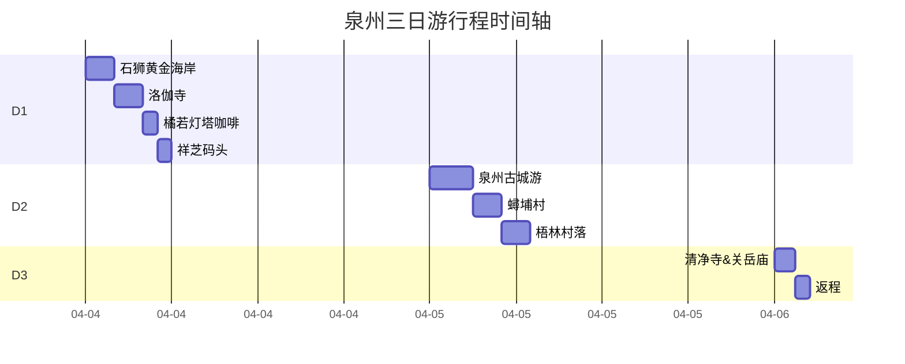
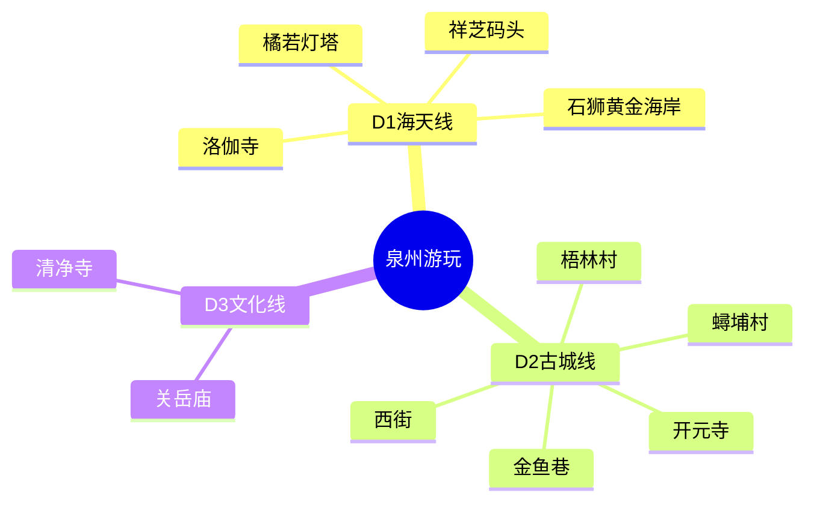

[TOC]

### **📅 泉州出行计划概览**

### **🚄 交通与住宿概览**

**交通信息**
| 行程 | 日期 | 车次 | 出发站 | 到达站 | 时间 |
|------|------|------|--------|--------|------|
| 去程 | 2025/4/4 | D3211 | 杭州东站 (07:08) | 泉州站 (12:31) | 5h23m |
| 返程 | 2025/4/6 | 待定 | 泉州站 | 杭州东站 | - |

**住宿信息**
- **酒店名称**：泉州古驿民宿
- **地址**：泉州鲤城区西街旧馆驿51号
- **入住时间**：4月4日-4月6日（2晚）
- **价格**：920元/2晚
- **位置优势**：位于西街核心区，步行可达开元寺、钟楼等景点

### **📅 出行计划**

#### **D1（4月4日，周五）**  
**主题：海天一色与南洋风情**  
- **07:08** 杭州东站出发 (D3211次列车)
- **12:31** 抵达泉州站，打车前往石狮黄金海岸（约60分钟，车程45公里，车费约150-180元）。  
- **13:30-15:00 石狮黄金海岸**  
  漫步沙滩，远眺“海上佛国”洛伽寺，拍摄礁石与海的壮丽大片。  
- **15:30-16:30 洛伽寺**  
  参观建在海上的寺庙，感受潮涨潮落的独特意境。  
- **17:00-18:00 橘若灯塔咖啡**  
  海边悬崖咖啡馆小憩，打卡粉色城堡和灯塔落日。  
- **18:30 祥芝码头（可选）**  
  若时间充裕，可前往渔港看渔船归港（打车15分钟），晚餐品尝海鲜排档。  
- **夜宿** 泉州古驿民宿（鲤城区西街旧馆驿51号）

---

#### **D2（4月5日，周六）**  
**主题：古城漫步与南洋旧梦**  
- **9:00-12:00 泉州古城深度游**  
  - **开元寺**：地标双塔拍照，红墙飞檐尽显闽南美学（1小时）。  
  - **西街**：穿行骑楼老街，吃润饼、土笋冻、面线糊（1小时）。  
  - **金鱼巷/象峰巷**：避开人潮，探秘小众红砖古厝（1小时）。  
- **13:00-15:00 蟳埔村簪花体验**  
  戴满头簪花、穿娘惹服饰，在蚵壳厝前拍南洋风写真（打车15分钟）。  
- **15:30-17:30 梧林传统村落**  
  南洋华侨建筑群，人少景美，适合慢逛拍照（打车25分钟，可选咖啡厅休憩）。  
- **傍晚** 返回市区，夜游中山路或领show天地酒吧街。  

---

#### **D3（4月6日，周日）**  
**主题：文化拾遗与返程**  
- **9:00-10:30** 清净寺+关岳庙  
  感受伊斯兰教与闽南信仰的融合（两庙相邻，步行5分钟）。  
- **11:00前** 退房（泉州古驿民宿）并打车前往泉州站（车程20分钟，预留时间避免拥堵）。  
- **12:00** 高铁返程杭州。  

---

### **🗺️ 出行地图标注**  
**D1石狮线**  
- **泉州站→黄金海岸**：45公里，打车60分钟  
- **黄金海岸→洛伽寺**：步行10分钟（同一景区内）  
- **洛伽寺→橘若咖啡**：步行15分钟  
- **橘若→祥芝码头**：8公里，打车15分钟  

**D2古城线**  
- **西街→开元寺**：步行5分钟  
- **西街→蟳埔村**：8公里，打车15分钟  
- **蟳埔村→梧林村落**：18公里，打车25分钟  

**D3市区线**  
- **酒店→清净寺**：建议共享电动车10分钟  
- **清净寺→泉州站**：10公里，打车20分钟  

---

### **💡 注意事项**  
1. **交通**：石狮景点分散，建议全程打车；古城内可租电动车（约30元/天）。  
2. **穿搭**：海边风大，建议戴帽子防风；簪花拍照穿浅色旗袍更出片。  
3. **预约**：蟳埔村簪花店（如女神佑）建议早到，避免排队。  
4. **美食**：西街推荐“春哥铁板烧”“吴氏麻糍”；石狮海鲜可去“古浮湾大排档”。
