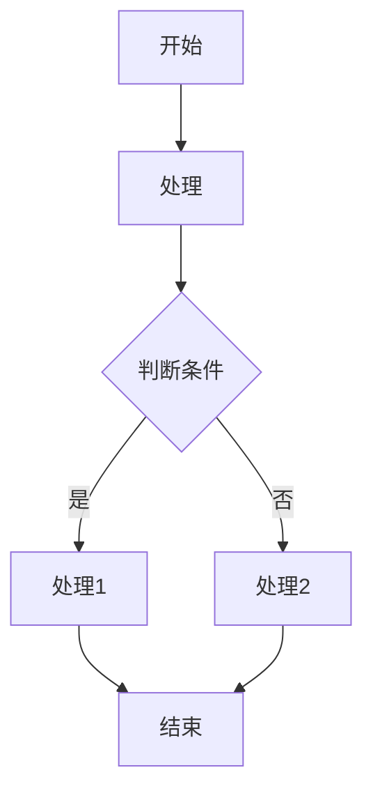
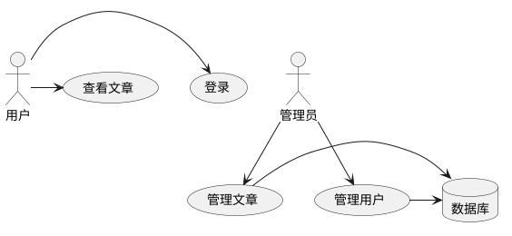

# 博客系统需求文档

## 文档信息

| 信息项 | 内容 |
| ------ | ---- |
| 文档版本 | V1.1 |
| 编写日期 | 2025-05-18 |
| 编写人员 | 项目团队 |
| 审核人员 | 项目负责人 |

## 变更记录

| 版本号 | 变更日期 | 变更人员 | 变更内容 |
| ------ | -------- | -------- | -------- |
| V1.0 | 2025-05-09 | 项目团队 | 初始版本 |
| V1.1 | 2025-05-12 | 项目团队 | 1. 优化搜索功能：修复分类筛选和搜索组合使用问题<br>2. 改进搜索UI：搜索图标改为搜索按钮，优化布局<br>3. 优化搜索体验：改为点击触发搜索，不再实时搜索<br>4. 优化列表页展示：添加发布时间和更新时间列，支持排序<br>5. 改进筛选区域UI：添加标题、状态和分类标签<br>6. 优化筛选条件显示：添加当前筛选条件可视化<br>7. 添加搜索结果数量显示 |

## 1. 产品概述

### 1.1 产品简介

本系统是一个现代化的博客平台，旨在提供用户友好的内容创作、发布和管理体验。系统支持文章创作、发布、分类、标签、评论等核心功能，同时注重内容展示效果和用户交互体验。

### 1.2 产品定位

- 面向个人创作者和小型团队的内容发布平台
- 注重简洁、高效的内容管理和优雅的展示效果
- 支持多种内容形式，包括文字、图片等多媒体元素

### 1.3 系统架构

系统采用现代前后端分离架构:

- 前端：Next.js框架，React组件库，支持SSR/SSG
- 后端：API服务层，数据存储层
- 数据库：关系型数据库，支持内容的结构化存储和高效查询

#### 1.3.1 系统架构图

```
┌─────────────────┐       ┌──────────────────┐      ┌────────────────┐
│                 │       │                  │      │                │
│   浏览器/客户端  │◄────► │  Next.js 应用服务 │◄────►│  SQLite 数据库  │
│                 │       │                  │      │ (data/db.sqlite)│
└─────────────────┘       └──────────────────┘      └────────────────┘
                                    ▲
                                    │
                                    ▼
                          ┌──────────────────┐      ┌────────────────┐
                          │                  │      │                │
                          │   数据同步服务    │◄────►│   GitHub 仓库   │
                          │                  │      │                │
                          └──────────────────┘      └────────────────┘
                                    ▲
                                    │
                                    ▼
                          ┌──────────────────┐
                          │                  │
                          │   语雀 API 集成   │
                          │                  │
                          └──────────────────┘
```

#### 1.3.2 技术栈选择

##### 1.3.2.1 前端技术

- 框架：Next.js
- UI组件库：Tailwind CSS
- 状态管理：React Context / Redux
- 客户端请求：Axios / SWR

##### 1.3.2.2 后端技术

- API框架：Next.js API Routes
- 数据库访问：ORM (Prisma/TypeORM)
- 身份验证：NextAuth.js
- 文件存储：本地存储/云存储

##### 1.3.2.3 数据库选择

- 主数据库：SQLite (data/db.sqlite)
- 缓存：Redis (可选)

## 2. 功能需求与详述

### 2.1 博客前端系统

#### 2.1.1 首页功能

**前端原型图**

```
+------------------------------------------------------+
|                      BLOG HEADER                     |
+--------------------------------------+---------------+
| Logo                                 |  [ 搜索框  ]  |
+--------------------------------------+---------------+
|                 导航栏                                |
| 首页 | 分类 | 标签 | 归档 | 关于                      |
+------------------------------------------------------+
|                                                      |
|  +------------------------------------------+        |
|  |                                          |        |
|  |             特色文章轮播区                |        |
|  |                                          |        |
|  +------------------------------------------+        |
|                                                      |
|  +------------------------+  +------------------+    |
|  |                        |  |                  |    |
|  |      最新文章区域      |  |    侧边栏        |    |
|  |                        |  |                  |    |
|  | +------------------+   |  | +--------------+ |    |
|  | | 文章卡片 1       |   |  | | 分类列表     | |    |
|  | |                  |   |  | +--------------+ |    |
|  | | [标题]           |   |  |                  |    |
|  | | [摘要内容...]    |   |  | +--------------+ |    |
|  | | [日期] [分类]    |   |  | | 标签云       | |    |
|  | +------------------+   |  | +--------------+ |    |
|  |                        |  |                  |    |
|  | +------------------+   |  | +--------------+ |    |
|  | | 文章卡片 2       |   |  | | 最近文章     | |    |
|  | |                  |   |  | +--------------+ |    |
|  | | [标题]           |   |  |                  |    |
|  | | [摘要内容...]    |   |  |                  |    |
|  | | [日期] [分类]    |   |  |                  |    |
|  | +------------------+   |  |                  |    |
|  |                        |  |                  |    |
|  | +------------------+   |  |                  |    |
|  | | 文章卡片 3       |   |  |                  |    |
|  | +------------------+   |  |                  |    |
|  |                        |  |                  |    |
|  | [分页控件]             |  |                  |    |
|  +------------------------+  +------------------+    |
|                                                      |
+------------------------------------------------------+
|                      页脚区域                         |
| © 2025 博客名称 | 联系方式 | 备案信息                |
+------------------------------------------------------+
```

**功能描述**
- 最新文章列表（分页显示）
- 精选文章轮播
- 分类导航
- 热门标签云
- 搜索框
- 响应式设计，适配移动端

**业务规则**
- 仅显示已发布的文章
- 最新文章按发布日期倒序排列
- 特色文章在轮播区域优先展示
- 每页默认显示10篇文章

#### 2.1.2 文章详情页

**前端原型图**

```
+------------------------------------------------------+
|                      BLOG HEADER                     |
+--------------------------------------+---------------+
| Logo                                 |  [ 搜索框  ]  |
+--------------------------------------+---------------+
|                 导航栏                                |
| 首页 | 分类 | 标签 | 归档 | 关于                      |
+------------------------------------------------------+
|                                                      |
|  +------------------------+  +------------------+    |
|  |                        |  |                  |    |
|  |    文章内容区域        |  |    侧边栏        |    |
|  |                        |  |                  |    |
|  | [文章标题]             |  | +--------------+ |    |
|  | [作者] [日期] [分类]   |  | | 文章目录     | |    |
|  |                        |  | | - 一级标题1  | |    |
|  | [文章封面图]           |  | |   - 二级标题 | |    |
|  |                        |  | | - 一级标题2  | |    |
|  | [文章正文内容...]      |  | |   - 二级标题 | |    |
|  |                        |  | +--------------+ |    |
|  | [代码块]               |  |                  |    |
|  | [图片]                 |  | +--------------+ |    |
|  | [引用]                 |  | | 相关文章     | |    |
|  |                        |  | | - 文章1      | |    |
|  | [表格]                 |  | | - 文章2      | |    |
|  |                        |  | | - 文章3      | |    |
|  | ...更多内容...         |  | +--------------+ |    |
|  |                        |  |                  |    |
|  | [标签]: Tag1, Tag2     |  | +--------------+ |    |
|  |                        |  | | 分享按钮     | |    |
|  | +------------------+   |  | | [微信][微博] | |    |
|  | | 上一篇 | 下一篇  |   |  | | [Twitter]    | |    |
|  | +------------------+   |  | +--------------+ |    |
|  |                        |  |                  |    |
|  | +------------------+   |  |                  |    |
|  | |    评论区域      |   |  |                  |    |
|  | |                  |   |  |                  |    |
|  | | [评论1]          |   |  |                  |    |
|  | | [评论2]          |   |  |                  |    |
|  | | [发表评论框]     |   |  |                  |    |
|  | +------------------+   |  |                  |    |
|  +------------------------+  +------------------+    |
|                                                      |
+------------------------------------------------------+
|                      页脚区域                         |
| © 2025 博客名称 | 联系方式 | 备案信息                |
+------------------------------------------------------+
```

**功能描述**
- 文章内容渲染（支持所有Markdown语法）
- 目录导航（自动根据标题生成）
- 相关文章推荐
- 评论系统（集成Giscus/Disqus等第三方评论）
- 社交分享按钮
- 上一篇/下一篇导航

**交互说明**
- 目录导航跟随滚动，点击目录项可快速定位到对应标题
- 相关文章根据标签相似度自动推荐
- 评论区支持Markdown格式回复
- 分享按钮支持主流社交媒体平台

#### 2.1.3 分类和标签页

**前端原型图 - 分类页**

```
+------------------------------------------------------+
|                      BLOG HEADER                     |
+--------------------------------------+---------------+
| Logo                                 |  [ 搜索框  ]  |
+--------------------------------------+---------------+
|                 导航栏                                |
| 首页 | 分类 | 标签 | 归档 | 关于                      |
+------------------------------------------------------+
|                                                      |
|  +------------------------------------------+        |
|  |               分类页标题                  |        |
|  +------------------------------------------+        |
|                                                      |
|  +----------------------------------------------+    |
|  |                                              |    |
|  |  分类列表（卡片式布局）                      |    |
|  |                                              |    |
|  |  +---------------+  +---------------+        |    |
|  |  | 技术          |  | 生活          |        |    |
|  |  | [25篇文章]    |  | [18篇文章]    |        |    |
|  |  +---------------+  +---------------+        |    |
|  |                                              |    |
|  |  +---------------+  +---------------+        |    |
|  |  | 读书笔记      |  | 项目          |        |    |
|  |  | [12篇文章]    |  | [8篇文章]     |        |    |
|  |  +---------------+  +---------------+        |    |
|  |                                              |    |
|  |  +---------------+  +---------------+        |    |
|  |  | 教程          |  | 随笔          |        |    |
|  |  | [15篇文章]    |  | [10篇文章]    |        |    |
|  |  +---------------+  +---------------+        |    |
|  |                                              |    |
|  +----------------------------------------------+    |
|                                                      |
|                                                      |
+------------------------------------------------------+
|                      页脚区域                         |
| © 2025 博客名称 | 联系方式 | 备案信息                |
+------------------------------------------------------+
```

**前端原型图 - 标签页**

```
+------------------------------------------------------+
|                      BLOG HEADER                     |
+--------------------------------------+---------------+
| Logo                                 |  [ 搜索框  ]  |
+--------------------------------------+---------------+
|                 导航栏                                |
| 首页 | 分类 | 标签 | 归档 | 关于                      |
+------------------------------------------------------+
|                                                      |
|  +------------------------------------------+        |
|  |               标签云                      |        |
|  |                                          |        |
|  |    JavaScript   React   CSS   Python     |        |
|  |                                          |        |
|  |  Vue   设计模式  TypeScript  Flutter     |        |
|  |                                          |        |
|  |    NextJS    API    数据库    Linux      |        |
|  |                                          |        |
|  |  Git   Docker   性能优化   工具   测试   |        |
|  |                                          |        |
|  +------------------------------------------+        |
|                                                      |
|  +------------------------------------------+        |
|  |               选中标签的文章列表          |        |
|  |                                          |        |
|  | 标签：JavaScript (共15篇文章)            |        |
|  |                                          |        |
|  | +--------------------------------------+ |        |
|  | | [文章标题1]                          | |        |
|  | | [发布日期] [阅读数]                  | |        |
|  | +--------------------------------------+ |        |
|  |                                          |        |
|  | +--------------------------------------+ |        |
|  | | [文章标题2]                          | |        |
|  | | [发布日期] [阅读数]                  | |        |
|  | +--------------------------------------+ |        |
|  |                                          |        |
|  | ...更多文章...                           |        |
|  |                                          |        |
|  | [分页控件]                               |        |
|  +------------------------------------------+        |
|                                                      |
+------------------------------------------------------+
|                      页脚区域                         |
| © 2025 博客名称 | 联系方式 | 备案信息                |
+------------------------------------------------------+
```

**功能描述**
- 分类列表视图
- 标签云视图
- 按分类/标签筛选文章
- 统计信息（每个分类/标签下的文章数量）

**业务规则**
- 按文章数量排序分类和标签
- 标签云字体大小与文章数量成正比
- 空分类和空标签默认不显示

#### 2.1.4 归档页

**功能描述**
- 按年月组织的文章归档
- 时间轴显示
- 按时间范围筛选文章

**交互说明**
- 可折叠/展开年份和月份
- 时间轴支持缩放和滚动
- 支持按年、月、日筛选查看

#### 2.1.5 搜索功能

**功能描述**
- 全文搜索
- 搜索建议
- 高级筛选（按标题、内容、分类、标签等）
- 搜索结果高亮

**交互说明**
- 输入时实时提供搜索建议
- 支持快捷键操作（Enter提交搜索，Esc清空搜索框等）
- 搜索结果页支持进一步筛选和排序

### 2.2 博客管理系统

#### 2.2.1 仪表盘

**前端原型图**

```
+------------------------------------------------------+
|                    后台管理系统                       |
+------------------+-----------------------------------+
|                  |                                   |
|    侧边栏菜单     |            仪表盘内容             |
|                  |                                   |
| +-------------+  | +------------+ +------------+     |
| | 仪表盘      |  | | 文章统计   | | 访问统计   |     |
| +-------------+  | | 总计: 87   | | 今日: 256  |     |
| | 文章管理    |  | | 已发布: 72 | | 本周: 1834 |     |
| +-------------+  | | 草稿: 15   | | 本月: 6209 |     |
| | 分类管理    |  | +------------+ +------------+     |
| +-------------+  |                                   |
| | 标签管理    |  | +-------------------------------+ |
| +-------------+  | |         分类和标签分布        | |
| | 评论管理    |  | |                               | |
| +-------------+  | |       [饼图/柱状图展示]       | |
| | 用户管理    |  | |                               | |
| +-------------+  | +-------------------------------+ |
| | 系统设置    |  |                                   |
| +-------------+  | +-------------------------------+ |
|                  | |         最近更新文章          | |
|                  | |                               | |
|                  | | +-------------------------+   | |
|                  | | | 标题              | 日期  | | |
|                  | | +-------------------------+   | |
|                  | | | [文章1]          | 05-20 | | |
|                  | | | [文章2]          | 05-18 | | |
|                  | | | [文章3]          | 05-16 | | |
|                  | | | ...              | ...   | | |
|                  | | +-------------------------+   | |
|                  | |                               | |
|                  | +-------------------------------+ |
|                  |                                   |
|                  | +-------------------------------+ |
|                  | |          快速操作             | |
|                  | |                               | |
|                  | | [新建文章] [导入文章]         | |
|                  | | [备份数据] [系统设置]         | |
|                  | |                               | |
|                  | +-------------------------------+ |
|                  |                                   |
+------------------+-----------------------------------+
```

**功能描述**
- 文章统计（总数、已发布、草稿）
- 分类和标签分布（饼图/柱状图展示）
- 最近更新的10篇文章（标题、日期、分类）
- 访问统计（支持按日/周/月筛选）
- 快速操作按钮（新建文章、导入文章）

**业务规则**
- 统计数据每小时自动更新一次
- 可手动刷新获取最新数据
- 访问统计支持导出CSV/Excel格式

#### 2.2.2 文章管理

**前端原型图**

```
+------------------------------------------------------+
|                    后台管理系统                       |
+------------------+-----------------------------------+
|                  |                                   |
|    侧边栏菜单     |           文章管理内容            |
|                  |                                   |
| +-------------+  | +-------------------------------+ |
| | 仪表盘      |  | | 文章管理      [新建文章]      | |
| +-------------+  | +-------------------------------+ |
| | 文章管理    |  |                                   |
| +-------------+  | +-------------------------------+ |
| | 分类管理    |  | | 搜索和筛选区域                | |
| +-------------+  | |                               | |
| | 标签管理    |  | | [搜索框]                      | |
| +-------------+  | | 状态: [全部▼] 分类: [全部▼]   | |
| | 评论管理    |  | | 标签: [选择标签...]           | |
| +-------------+  | |                               | |
| | 用户管理    |  | | 当前筛选条件：已发布、技术分类 | |
| +-------------+  | +-------------------------------+ |
| | 系统设置    |  |                                   |
| +-------------+  | +-------------------------------+ |
|                  | | 文章列表  （共87篇文章）       | |
|                  | |                               | |
|                  | | +--------------------------+   | |
|                  | | | 标题 | 状态 | 分类 | 日期 |   | |
|                  | | +--------------------------+   | |
|                  | | | 文章1 | ● | 技术 | 05-20 |   | |
|                  | | | 文章2 | ○ | 生活 | 05-18 |   | |
|                  | | | 文章3 | ● | 教程 | 05-16 |   | |
|                  | | | ...   | .. | ...  | ...   |   | |
|                  | | +--------------------------+   | |
|                  | |                               | |
|                  | | [分页控件]                    | |
|                  | +-------------------------------+ |
|                  |                                   |
|                  | +-------------------------------+ |
|                  | | 批量操作                      | |
|                  | |                               | |
|                  | | [删除] [发布] [取消发布]      | |
|                  | | [设为特色] [取消特色]         | |
|                  | |                               | |
|                  | +-------------------------------+ |
|                  |                                   |
+------------------+-----------------------------------+
```

**文章编辑界面原型图**

```
+------------------------------------------------------+
|                    后台管理系统                       |
+------------------+-----------------------------------+
|                  |                                   |
|    侧边栏菜单     |           文章编辑内容            |
|                  |                                   |
| +-------------+  | +-------------------------------+ |
| | 仪表盘      |  | | 编辑文章      [返回列表]      | |
| +-------------+  | +-------------------------------+ |
| | 文章管理    |  |                                   |
| +-------------+  | +-------------------------------+ |
| | 分类管理    |  | | 文章基本信息                  | |
| +-------------+  | |                               | |
| | 标签管理    |  | | 标题：[                     ] | |
| +-------------+  | | 别名：[                     ] | |
| | 评论管理    |  | | 分类：[    ▼ ] 标签：[      ] | |
| +-------------+  | | 特色图片：[   选择图片...    ] | |
| | 用户管理    |  | | 状态：[已发布▼] 发布日期：[  ] | |
| +-------------+  | +-------------------------------+ |
| | 系统设置    |  |                                   |
| +-------------+  | +-------------------------------+ |
|                  | | 工具栏                        | |
|                  | | [B][I][H1][H2][链接][表格]... | |
|                  | +-------------------------------+ |
|                  | | 编辑器                        | |
|                  | |                               | |
|                  | | +-------------------------+   | |
|                  | | |                         |   | |
|                  | | |                         |   | |
|                  | | |  Markdown编辑区域       |   | |
|                  | | |                         |   | |
|                  | | |                         |   | |
|                  | | |                         |   | |
|                  | | +-------------------------+   | |
|                  | |                               | |
|                  | | [预览] [分屏模式] [全屏编辑]  | |
|                  | +-------------------------------+ |
|                  |                                   |
|                  | +-------------------------------+ |
|                  | | 文章元数据                    | |
|                  | |                               | |
|                  | | 摘要：[                     ] | |
|                  | | SEO标题：[                  ] | |
|                  | | SEO描述：[                  ] | |
|                  | |                               | |
|                  | +-------------------------------+ |
|                  |                                   |
|                  | [保存草稿] [预览] [发布]          |
|                  |                                   |
+------------------+-----------------------------------+
```

**管理流程**
1. 创建文章草稿
2. 编辑文章内容和元数据
3. 预览文章效果
4. 发布或设置定时发布
5. 后续管理（编辑、归档、删除）

**权限控制**
- 管理员：完全控制权限
- 编辑：可编辑所有文章
- 作者：只能编辑自己的文章

**内容编辑器方案**

为解决项目中存在的unified库版本冲突问题（Bytemd使用10.1.2版本，而项目其他部分使用11.0.5版本），同时提升内容创作体验，系统现已采用自主开发的轻量级Markdown编辑器组件，替代原有的ByteMD组件。

1. **编辑器组件体系**
   - **SimpleEditor**: 核心编辑组件，提供基础markdown编辑能力和语法格式工具栏
   - **AdvancedEditor**: 增强版编辑器，基于SimpleEditor扩展，添加实时预览和目录功能
   - **MarkdownRenderer**: 统一的Markdown渲染组件，确保编辑和展示一致性
   - **备用方案**: 保留FallbackEditor作为降级方案

2. **编辑器功能特性**
   - 无依赖冲突: 不依赖complex unified库，解决版本冲突问题
   - 轻量高效: 基于DOM原生TextArea实现，启动快速，运行稳定
   - 分屏预览: 支持编辑/预览/分屏三种模式自由切换
   - 目录导航: 自动提取文档标题，生成可点击目录
   - 工具栏: 丰富的Markdown格式化工具，悬停时显示详细功能提示
   - 图片上传: 支持本地图片上传并自动插入链接

3. **全站统一编辑与渲染方案**

为保证编辑、预览、详情页渲染体验完全一致，系统所有涉及Markdown编辑与渲染的页面全部统一采用自研编辑器与渲染器，支持以下Markdown语法和功能：

| 能力/语法         | 支持情况 | 说明/插件                |
|------------------|----------|--------------------------|
| 标题             | ✅        | 标准 markdown            |
| 段落/换行        | ✅        | 标准 markdown            |
| 有序/无序列表     | ✅        | 标准 markdown            |
| 任务列表         | ✅        | GFM 插件                 |
| 引用             | ✅        | 标准 markdown            |
| 链接             | ✅        | 标准 markdown            |
| 图片             | ✅        | 标准 markdown            |
| 表格             | ✅        | GFM 插件                 |
| 代码块/行内代码   | ✅        | 标准 markdown            |
| 粗体/斜体/删除线 | ✅        | 标准 markdown            |
| 数学公式         | ✅        | 使用 KaTeX 渲染          |
| 目录 [toc]       | ✅        | 自定义实现               |
| 高亮代码         | ✅        | Prism 高亮支持多种语言    |
| Emoji            | ✅        | Unicode 直接支持         |
| HTML 块          | ⚠️        | 支持白名单标签，安全渲染  |
| Mermaid图表      | ✅        | 多种图表类型全面支持      |
| Admonition 块    | ✅        | 自定义实现，支持多种样式  |
| 图片上传         | ✅        | 自定义上传实现           |
| 全屏/预览切换    | ✅        | 内置布局控制             |
| 工具栏交互       | ✅        | 悬停提示与分组设计        |
| 本地化           | ✅        | 中文界面                 |

4. **图表支持类型**

编辑器现已支持以下多种Mermaid图表类型：

| 图表类型       | 说明                       | 语法格式                  |
|---------------|----------------------------|--------------------------|
| 流程图        | 展示流程和决策路径          | ```mermaid\ngraph TD     |
| 时序图        | 展示对象间的交互和消息流    | ```mermaid\nsequenceDiagram |
| 类图          | 展示类结构和关系           | ```mermaid\nclassDiagram |
| 状态图        | 展示状态转换               | ```mermaid\nstateDiagram-v2 |
| 甘特图        | 展示项目计划和任务         | ```mermaid\ngantt        |
| 饼图          | 展示比例数据               | ```mermaid\npie          |
| ER图          | 展示实体关系               | ```mermaid\nerDiagram    |

5. **提示块样式支持**

编辑器支持以下多种提示块样式：

| 提示块类型     | 说明                       | 语法格式                 |
|---------------|----------------------------|--------------------------|
| 提示 (tip)    | 提供有用的建议和提示        | :::tip\n内容\n:::       |
| 警告 (warning)| 提醒用户潜在问题            | :::warning\n内容\n:::   |
| 重要 (important) | 标记重要信息             | :::important\n内容\n::: |
| 信息 (info)   | 提供背景或上下文信息        | :::info\n内容\n:::      |

6. **工具栏增强**

工具栏已进行以下增强：

- **分组设计**: 将功能按类型分组，提高查找效率
- **工具提示**: 鼠标悬停时显示详细功能说明
- **工具图标优化**: 使用直观图标表示功能
- **提示交互**: 动态显示简洁的功能说明浮层

7. **示例文档**

为方便用户学习和测试编辑器功能，系统提供了完整的Markdown功能示例文档：`docs/markdown-完整示例.md`，涵盖所有支持的语法和功能。

#### 2.2.3 内容管理功能

##### 2.2.3.1 分类管理

**功能描述**
- 创建、编辑、删除分类
- 分类层级关系设置
- 分类文章统计和展示
- 分类层次导航
- 批量操作功能

**业务规则**
- 分类可设置父子关系，最多支持3级嵌套
- 删除分类时需处理关联文章
- 分类排序支持拖拽调整
- 禁止创建同名分类
- 移动分类时自动更新文章关联

##### 2.2.3.2 标签管理

**功能描述**
- 创建、编辑、删除标签
- 标签关联和智能推荐 
- 标签云展示
- 标签使用统计
- 标签批量操作

**业务规则**
- 标签名称唯一，不区分大小写
- 标签合并功能：可将多个相似标签合并
- 智能推荐：创建文章时根据内容推荐相关标签
- 自动清理：定期清理未使用标签
- 别名系统：支持标签同义词管理

##### 2.2.3.3 内容导入

###### 2.2.3.3.1 语雀导入功能

**功能描述**
- API认证与获取文章列表
- 内容转换与处理
- 图片资源处理
- 分类标签映射
- 增量同步支持

**导入流程**
1. API授权配置
2. 选择知识库和文档
3. 设置导入规则
4. 执行导入任务
5. 查看导入报告

###### 2.2.3.3.2 其他平台导入

**支持平台**
- Markdown文件
- WordPress导出文件
- 简书
- 知乎专栏

**导入选项**
- 保留原始创建时间
- 自动生成分类
- 提取标签
- 处理图片资源

#### 2.2.4 用户管理

**功能描述**
- 用户认证和授权
- 角色分配：管理员、编辑、作者、读者
- 功能权限控制
- 内容访问权限控制

**权限设计**
1. 超级管理员：拥有所有权限
2. 编辑：可以管理所有内容，但无法修改系统设置
3. 作者：只能管理自己创建的内容
4. 读者：只有浏览权限，无管理权限

## 3. 产品功能规划

### 3.1 核心功能

#### 3.1.1 功能清单

| 模块 | 子模块 | 功能点 | 优先级 | 迭代 | 状态 | 负责人 |
|------|-------|--------|-------|------|------|-------|
| 内容管理 | 仪表盘 | 文章统计 | P0 | v1.0 | 已完成 | 张三 |
| 内容管理 | 仪表盘 | 分类标签统计 | P0 | v1.0 | 已完成 | 张三 |
| 内容管理 | 仪表盘 | 最近更新文章 | P0 | v1.0 | 已完成 | 张三 |
| 内容管理 | 仪表盘 | 访问统计 | P1 | v1.0 | 开发中 | 李四 |
| 内容管理 | 文章管理 | 创建文章 | P0 | v1.0 | 已完成 | 张三 |
| 内容管理 | 文章管理 | 文章列表 | P0 | v1.0 | 已完成 | 张三 |
| 内容管理 | 文章管理 | 文章筛选排序 | P0 | v1.0 | 已完成 | 王五 |
| 内容管理 | 文章管理 | 批量操作 | P1 | v1.0 | 开发中 | 王五 |
| 内容管理 | 语雀导入 | API认证 | P1 | v1.1 | 开发中 | 赵六 |
| 内容管理 | 语雀导入 | 内容转换 | P1 | v1.1 | 开发中 | 赵六 |
| 内容管理 | 编辑器 | Markdown编辑 | P0 | v1.0 | 已完成 | 张三 |
| 内容管理 | 编辑器 | 实时预览 | P0 | v1.0 | 已完成 | 张三 |
| 内容管理 | 编辑器 | 媒体管理 | P1 | v1.0 | 开发中 | 李四 |
| 内容管理 | 编辑器 | 元数据管理 | P0 | v1.0 | 已完成 | 张三 |
| 前端展示 | 首页 | 文章列表 | P0 | v1.0 | 已完成 | 王五 |
| 前端展示 | 首页 | 分类导航 | P0 | v1.0 | 已完成 | 王五 |
| 前端展示 | 文章页 | 内容渲染 | P0 | v1.0 | 已完成 | 王五 |
| 前端展示 | 文章页 | 目录导航 | P1 | v1.0 | 已完成 | 王五 |
| 前端展示 | 分类页 | 分类列表 | P0 | v1.0 | 已完成 | 王五 |
| 前端展示 | 标签页 | 标签云 | P0 | v1.0 | 已完成 | 王五 |
| 前端展示 | 归档页 | 时间轴 | P1 | v1.1 | 开发中 | 李四 |
| 前端展示 | 搜索 | 全文搜索 | P1 | v1.1 | 开发中 | 李四 |
| 系统功能 | 备份同步 | GitHub备份 | P1 | v1.0 | 已完成 | 赵六 |
| 系统功能 | 备份同步 | 自动同步 | P1 | v1.0 | 已完成 | 赵六 |
| 系统功能 | 站点设置 | 基本设置 | P0 | v1.0 | 已完成 | 张三 |
| 系统功能 | 站点设置 | SEO设置 | P1 | v1.1 | 开发中 | 李四 |
| 系统功能 | 用户管理 | 用户认证 | P0 | v1.0 | 已完成 | 赵六 |
| 系统功能 | 用户管理 | 权限控制 | P1 | v1.1 | 开发中 | 赵六 |
| 系统功能 | 性能优化 | 静态资源优化 | P2 | v1.2 | 计划中 | - |
| 系统功能 | 性能优化 | 缓存机制 | P2 | v1.2 | 计划中 | - |

## 4. 数据模型

### 4.1 核心数据模型

#### 4.1.1 文章(Post)

| 字段名 | 类型 | 描述 | 约束 |
| ------ | ---- | ---- | ---- |
| id | INTEGER | 文章唯一标识符 | 主键，自增 |
| slug | TEXT | URL友好的标识符 | 唯一，非空 |
| title | TEXT | 文章标题 | 非空 |
| content | TEXT | Markdown格式内容 | - |
| content_html | TEXT | 渲染后的HTML内容 | - |
| excerpt | TEXT | 文章摘要 | - |
| description | TEXT | 文章描述 | - |
| is_published | BOOLEAN | 是否已发布 | 非空，默认0 |
| is_featured | BOOLEAN | 是否特色文章 | 非空，默认0 |
| is_yaml_valid | BOOLEAN | 元数据是否有效 | 非空，默认1 |
| is_manually_edited | BOOLEAN | 是否手动编辑过 | 非空，默认0 |
| reading_time | INTEGER | 阅读时间(分钟) | 默认0 |
| source_path | TEXT | 源文件路径 | 最大长度512 |
| image_url | TEXT | 封面图片URL | 最大长度512 |
| yuque_url | TEXT | 语雀原文URL | 最大长度512 |
| created_at | DATETIME | 创建时间 | 非空，默认当前时间 |
| updated_at | DATETIME | 更新时间 | 非空，默认当前时间 |
| published_at | DATETIME | 发布时间 | - |

#### 4.1.2 分类(Category)

| 字段名 | 类型 | 描述 | 约束 |
| ------ | ---- | ---- | ---- |
| id | INTEGER | 分类唯一标识符 | 主键，自增 |
| name | TEXT | 分类名称 | 非空 |
| slug | TEXT | URL友好的标识符 | 唯一，非空 |
| description | TEXT | 分类描述 | - |
| parent_id | INTEGER | 父分类ID | 外键(self) |
| post_count | INTEGER | 文章数量 | 非空，默认0 |
| created_at | DATETIME | 创建时间 | 非空，默认当前时间 |
| updated_at | DATETIME | 更新时间 | 非空，默认当前时间 |

#### 4.1.3 标签(Tag)

| 字段名 | 类型 | 描述 | 约束 |
| ------ | ---- | ---- | ---- |
| id | INTEGER | 标签唯一标识符 | 主键，自增 |
| name | TEXT | 标签名称 | 非空 |
| slug | TEXT | URL友好的标识符 | 唯一，非空 |
| post_count | INTEGER | 文章数量 | 非空，默认0 |
| created_at | DATETIME | 创建时间 | 非空，默认当前时间 |
| updated_at | DATETIME | 更新时间 | 非空，默认当前时间 |

#### 4.1.4 文章-分类关联(PostCategory)

| 字段名 | 类型 | 描述 | 约束 |
| ------ | ---- | ---- | ---- |
| post_id | INTEGER | 文章ID | 外键，联合主键 |
| category_id | INTEGER | 分类ID | 外键，联合主键 |
| created_at | DATETIME | 创建时间 | 非空，默认当前时间 |

#### 4.1.5 文章-标签关联(PostTag)

| 字段名 | 类型 | 描述 | 约束 |
| ------ | ---- | ---- | ---- |
| post_id | INTEGER | 文章ID | 外键，联合主键 |
| tag_id | INTEGER | 标签ID | 外键，联合主键 |
| created_at | DATETIME | 创建时间 | 非空，默认当前时间 |

#### 4.1.6 URL映射(SlugMapping)

| 字段名 | 类型 | 描述 | 约束 |
| ------ | ---- | ---- | ---- |
| slug | TEXT | URL标识符 | 主键 |
| post_id | INTEGER | 文章ID | 外键，非空 |
| is_primary | BOOLEAN | 是否主要URL | 非空，默认0 |
| created_at | DATETIME | 创建时间 | 非空，默认当前时间 |
| updated_at | DATETIME | 更新时间 | 非空，默认当前时间 |

#### 4.1.7 同步状态(SyncStatus)

| 字段名 | 类型 | 描述 | 约束 |
| ------ | ---- | ---- | ---- |
| id | INTEGER | 记录ID | 主键，固定为1 |
| last_sync_time | DATETIME | 最后同步时间 | - |
| is_sync_in_progress | BOOLEAN | 是否正在同步 | 非空，默认0 |
| updated_at | DATETIME | 更新时间 | 非空，默认当前时间 |

### 4.2 关系模型

#### 4.2.1 关系图示

```
+----------------+       +-------------------+       +---------------+
|                |       |                   |       |               |
|     posts      |       |  post_categories  |       |  categories   |
|                |◄──────┤                   ├──────►|               |
+----------------+       +-------------------+       +---------------+
        ▲                                                   ▲
        │                                                   │
        │                +-------------------+       +------+--------+
        │                |                   |       |               |
        │                |    post_tags      |       |  categories   |
        │                |                   |       |  (parent)     |
        │                +-------------------+       |               |
        │                        │                   +---------------+
        │                        ▼                   
        │                +---------------+           
        │                |               |           
        │                |     tags      |           
        │                |               |           
        │                +---------------+           
        │                
        │                
+----------------+       +-------------------+
|                |       |                   |
|  slug_mapping  |◄──────┤     posts         |
|                |       |                   |
+----------------+       +-------------------+
```

#### 4.2.2 关系说明

- **文章-分类**：多对多关系，通过`post_categories`关联表实现
  - 外键：`post_categories.post_id` 引用 `posts.id` (级联删除)
  - 外键：`post_categories.category_id` 引用 `categories.id` (级联删除)

- **文章-标签**：多对多关系，通过`post_tags`关联表实现
  - 外键：`post_tags.post_id` 引用 `posts.id` (级联删除)
  - 外键：`post_tags.tag_id` 引用 `tags.id` (级联删除)

- **分类-分类**：自引用一对多关系，实现分类的层级结构
  - 外键：`categories.parent_id` 引用 `categories.id`

- **URL映射-文章**：一对多关系，一篇文章可以有多个URL映射
  - 外键：`slug_mapping.post_id` 引用 `posts.id` (级联删除)

#### 4.2.3 索引设计

为优化查询性能，数据库包含以下索引：

- 文章表(posts)
  - `idx_posts_is_published`: 按发布状态索引
  - `idx_posts_is_featured`: 按特色状态索引
  - `idx_posts_created_at`: 按创建时间索引
  - `idx_posts_updated_at`: 按更新时间索引
  - `idx_posts_published_at`: 按发布时间索引

- 分类表(categories)
  - `idx_categories_slug`: 按slug索引
  - `idx_categories_parent_id`: 按父分类ID索引

- 标签表(tags)
  - `idx_tags_slug`: 按slug索引

### 4.3 Slug生成规则

Slug是URL友好的字符串标识符，用于在网址中表示资源。为确保系统中的所有slug保持一致、易读且URL友好，特制定以下生成规则：

#### 4.3.1 基本原则

1. **简洁性**：Slug应尽量简短，便于记忆和输入
2. **可读性**：Slug应保留原文信息，使人能够从URL中识别内容
3. **URL安全**：只包含字母、数字、连字符，避免特殊字符和空格
4. **唯一性**：系统中的每个资源应有唯一的slug
5. **稳定性**：一旦生成，不应频繁变更，以保持链接持久性

#### 4.3.2 生成算法

文章、分类和标签的slug按照以下步骤生成：

1. **中文处理**：
   - 将中文转换为拼音
   - 例如："博客系统" → "blog-xi-tong"

2. **特殊字符处理**：
   - 移除所有特殊字符（如：`!@#$%^&*()=+[]{}|;:'",.<>/?~）
   - 将空格替换为连字符（-）
   - 将多个连续连字符合并为一个

3. **大小写处理**：
   - 将所有字符转换为小写

4. **长度限制**：
   - 限制最大长度为80个字符
   - 如果超过限制，保留开头和结尾的部分，中间部分截断

5. **唯一性处理**：
   - 检查数据库中是否已存在相同slug
   - 如果已存在，在末尾添加递增数字（例如：my-post-1, my-post-2）

#### 4.3.3 示例转换

| 原始标题 | 生成的Slug |
|---------|------------|
| 博客系统需求文档 | blog-xi-tong-xu-qiu-wen-dang |
| Hello World! | hello-world |
| 如何提高编程效率？ | ru-he-ti-gao-bian-cheng-xiao-lv |
| JavaScript 最佳实践 | javascript-zui-jia-shi-jian |
| 2023年度总结 | 2023-nian-du-zong-jie |
| 深入理解React Hooks | shen-ru-li-jie-react-hooks |


#### 4.3.4 实现细节

1. **技术选择**：
   - 使用`limax`库进行拼音转换和slug生成
   - 配置项：`{tone: false, separator: '-', allowedChars: 'a-zA-Z0-9-'}`

2. **生成时机**：
   - 新建文章、分类、标签时自动生成
   - 编辑标题后，系统提示是否更新slug，但不强制更新（保持URL稳定性）

3. **冲突处理**：
   - 使用数据库事务确保唯一性检查和插入的原子性
   - 采用递增数字后缀解决冲突

4. **性能考虑**：
   - 使用索引优化slug查询性能
   - 缓存常用slug映射，减少数据库查询

## 5. API接口设计

### 5.1 文章接口

| 接口 | 方法 | 描述 |
| ---- | ---- | ---- |
| /api/posts | GET | 获取文章列表 |
| /api/posts/{id} | GET | 获取特定文章 |
| /api/posts | POST | 创建新文章 |
| /api/posts/{id} | PUT | 更新特定文章 |
| /api/posts/{id} | DELETE | 删除特定文章 |

### 5.2 分类接口

| 接口 | 方法 | 描述 |
| ---- | ---- | ---- |
| /api/categories | GET | 获取分类列表 |
| /api/categories/{id} | GET | 获取特定分类 |
| /api/categories | POST | 创建新分类 |
| /api/categories/{id} | PUT | 更新特定分类 |
| /api/categories/{id} | DELETE | 删除特定分类 |

### 5.3 标签接口

| 接口 | 方法 | 描述 |
| ---- | ---- | ---- |
| /api/tags | GET | 获取标签列表 |
| /api/tags/{id} | GET | 获取特定标签 |
| /api/tags | POST | 创建新标签 |
| /api/tags/{id} | PUT | 更新特定标签 |
| /api/tags/{id} | DELETE | 删除特定标签 |

## 6. 非功能需求

### 6.1 性能需求

- 页面加载时间：首屏渲染不超过1.5秒
- API响应时间：95%的请求在500ms内完成
- 系统支持并发用户数：最少100同时在线用户

### 6.2 安全需求

- 用户认证：基于JWT的身份验证
- 数据加密：敏感数据存储加密
- XSS防护：前端输入过滤和后端验证
- CSRF防护：令牌验证
- 权限控制：基于RBAC模型

### 6.3 可用性需求

- 系统可用性：99.9%
- 备份恢复：每日自动备份，支持快速恢复
- 监控告警：关键指标监控和异常告警

### 6.4 扩展性需求

- 模块化设计：支持功能模块的灵活组合
- 插件机制：支持第三方功能扩展
- 主题系统：支持自定义外观主题

## 7. 功能扩展模块

### 7.1 媒体资源管理

#### 7.1.1 图片存储解决方案

##### 7.1.1.1 需求概述

博客系统需要支持图片上传功能，允许用户在文章编辑过程中插入图片，并确保图片能够高效存储和快速加载。

##### 7.1.1.2 存储方案设计

考虑到SQLite数据库不适合直接存储大量二进制图片数据（会导致数据库体积膨胀、性能下降），系统采用混合存储方案：

###### 7.1.1.2.1 文件系统存储（本地开发环境）

- **存储位置**：`public/uploads/images/YYYY/MM/`（按年月组织目录结构）
- **文件命名**：`${timestamp}-${randomString}-${originalFilename}`
- **访问方式**：通过Web服务器直接访问，URL格式为`/uploads/images/YYYY/MM/filename.ext`
- **优势**：
  - 实现简单，无需额外服务
  - 开发环境快速部署
  - 便于本地测试和调试
- **限制**：
  - 不适合多服务器部署
  - 备份和迁移需要额外处理
  - 无法利用CDN加速

###### 7.1.1.2.2 云对象存储（生产环境）

- **存储服务**：支持阿里云OSS、腾讯云COS、AWS S3等主流对象存储服务
- **目录结构**：`blog/images/YYYY/MM/filename.ext`
- **访问方式**：通过对象存储服务的URL或配置的CDN域名访问
- **优势**：
  - 高可用性和可靠性
  - 支持CDN加速
  - 易于扩展和管理
  - 支持多服务器部署
- **配置项**：
  - 存储服务类型
  - 访问密钥和区域
  - CDN域名
  - 访问控制策略

##### 7.1.1.3 数据模型设计

为管理图片资源，系统将创建以下数据表：

###### 7.1.1.3.1 图片表(Images)

| 字段名 | 类型 | 描述 | 约束 |
| ------ | ---- | ---- | ---- |
| id | INTEGER | 图片唯一标识符 | 主键，自增 |
| filename | TEXT | 文件名（含扩展名） | 非空 |
| original_filename | TEXT | 原始文件名 | 非空 |
| path | TEXT | 存储路径 | 非空 |
| url | TEXT | 访问URL | 非空 |
| size | INTEGER | 文件大小(字节) | 非空 |
| width | INTEGER | 图片宽度(像素) | - |
| height | INTEGER | 图片高度(像素) | - |
| mime_type | TEXT | MIME类型 | 非空 |
| storage_type | TEXT | 存储类型(local/oss/cos/s3) | 非空，默认'local' |
| post_id | INTEGER | 关联文章ID | 外键 |
| created_at | DATETIME | 创建时间 | 非空，默认当前时间 |
| updated_at | DATETIME | 更新时间 | 非空，默认当前时间 |

###### 7.1.1.3.2 关系设计

- **图片-文章**：多对一关系
  - 外键：`images.post_id` 引用 `posts.id` (设置为NULL而非级联删除)
  - 说明：一篇文章可以包含多张图片，但一张图片只能属于一篇文章

##### 7.1.1.4 功能实现

###### 7.1.1.4.1 上传流程

1. **前端实现**：
   - 编辑器集成图片上传按钮
   - 支持拖拽上传和剪贴板粘贴
   - 上传前预览和简单编辑（裁剪、调整大小）
   - 上传进度显示

2. **后端处理**：
   - 文件验证（类型、大小、安全性）
   - 图片优化（压缩、调整大小）
   - 存储路径生成
   - 元数据提取（尺寸、类型）
   - 数据库记录创建

3. **响应处理**：
   - 返回图片URL和元数据
   - 编辑器自动插入图片Markdown代码

### 7.2 编辑器功能增强

#### 7.2.1 工具栏增强与文本绘图能力

##### 7.2.1.1 工具栏界面优化

为解决编辑器工具栏使用体验问题，特别是工具提示被导航栏遮挡的问题，系统做了以下优化：

###### 7.2.1.1.1 工具栏布局优化

- **分组设计**：工具按钮按功能类型分组，提高查找效率
- **优先级分层**：
  - 优先级1（常用）：格式、标题、列表等基础功能
  - 优先级2（次常用）：插入链接/图片、引用、表格等
  - 优先级3（高级）：数学公式、图表、特殊块等
- **视觉分隔**：使用边框和间距增强组间视觉区分

###### 7.2.1.1.2 工具提示交互改进

- **层级提升**：将提示气泡的z-index提高至10000，确保显示在最顶层
- **方向自适应**：
  - 工具栏顶部按钮的提示向上显示
  - 下拉菜单中的按钮提示向下或侧向显示
  - 特定位置的按钮提示添加位置偏移，避免被导航栏遮挡
- **箭头指向优化**：提示箭头始终正确指向对应按钮
- **样式美化**：半透明背景、圆角设计和过渡动画

###### 7.2.1.1.3 移动端适配

- **自动检测屏幕尺寸**，调整UI布局
- **工具按钮合并**：小屏幕上自动合并次常用工具为下拉菜单
- **触摸友好**：优化按钮尺寸和间距，适合手指操作

##### 7.2.1.2 文本绘图能力增强

为满足用户对各类图表的创建需求，系统全面增强了文本绘图能力：

###### 7.2.1.2.1 Mermaid图表支持

系统已实现全面支持Mermaid图表语法，用户可以创建以下类型的图表：

- **流程图** (Flowchart)：展示流程和决策路径
- **时序图** (Sequence)：展示对象之间的交互和消息流
- **类图** (Class)：展示类结构和关系
- **状态图** (State)：展示状态转换
- **甘特图** (Gantt)：展示项目计划和任务
- **饼图** (Pie)：展示比例数据
- **ER图** (Entity Relationship)：展示实体关系

###### 7.2.1.2.2 PlantUML图表支持

系统新增对PlantUML语法的支持，补充了Mermaid在某些图表类型上的不足：

- **用例图** (Use Case)：展示用户和系统功能
- **类图** (Class)：比Mermaid提供更丰富的表示能力
- **活动图** (Activity)：展示工作流程和逻辑
- **时序图** (Sequence)：提供更灵活的消息流表示

###### 7.2.1.2.3 图表创建体验优化

- **统一入口**：工具栏中提供"插入文本绘图"按钮，打开图表选择器
- **分类浏览**：按图表类型分类展示各种图表模板
- **即时预览**：选择模板后可预览和编辑图表代码
- **一键插入**：确认后将图表代码插入到编辑器当前位置

###### 7.2.1.2.4 图表渲染能力

- **自动识别**：根据代码块语言标识自动选择渲染引擎
- **错误处理**：提供友好的错误提示，显示具体错误原因
- **加载状态**：渲染过程中显示加载状态，提升用户体验
- **统一样式**：所有图表应用一致的边框和间距样式

##### 7.2.1.3 编辑器功能示例

为方便用户学习和使用编辑器的各种功能，系统提供了完整的功能示例：

###### 7.2.1.3.1 基础语法示例

```markdown
# 一级标题
## 二级标题

**粗体文本**
*斜体文本*
~~删除线文本~~

- 无序列表项
- 另一项

1. 有序列表项
2. 另一项

> 引用文本
```

###### 7.2.1.3.2 图表语法示例

**Mermaid流程图示例**:
```markdown

```

**PlantUML用例图示例**:
```markdown

```

###### 7.2.1.3.3 高级功能示例

**数学公式**:
```markdown
行内公式: $E = mc^2$

块级公式: 
$$
\frac{d}{dx}(x^n) = nx^{n-1}
$$
```

**提示块**:
```markdown
:::tip
这是一个提示信息块
:::

:::warning
这是一个警告信息块
:::
```

**目录生成**:
```markdown
[toc]

## 第一章
内容...

## 第二章
内容...
```

### 7.3 数据同步与备份

#### 7.3.1 备份与同步功能

##### 7.3.1.1 GitHub备份功能

###### 7.3.1.1.1 功能概述

备份系统会将SQLite数据库中的文章内容以结构化方式导出到GitHub仓库，方便内容版本控制和历史追踪。主要功能包括：

- 博客文章内容备份（按分类组织）
- 文章元数据分离存储（方便浏览和对比）
- 分类和标签信息导出
- 自动创建目录结构和README
- 定时执行备份（可配置）

###### 7.3.1.1.2 备份内容结构

备份到GitHub的内容按照以下结构组织：

```
/
├── content/           # 博客内容目录
│   ├── posts/         # 已发布的博客文章
│   │   ├── tech-tools/    # 技术工具分类的文章
│   │   ├── finance/       # 金融分类的文章
│   │   └── ...            # 其他分类
│   └── assets/        # 媒体资源文件
│       └── images/    # 图片资源
├── categories.json    # 分类信息
└── posts-overview.json # 文章概览信息
```

每篇文章会生成两个文件：
- `[slug].md` - 文章内容（纯Markdown格式）
- `[slug].meta.json` - 文章元数据（JSON格式，包含标题、日期、标签等）

###### 7.3.1.1.3 配置说明

**GitHub Token设置**

备份功能需要GitHub个人访问令牌(PAT)来访问和更新仓库。请按照以下步骤配置：

1. 在GitHub上创建个人访问令牌：
   - 访问 https://github.com/settings/tokens
   - 点击"Generate new token (classic)"
   - 勾选"repo"权限
   - 生成并复制令牌

2. 设置环境变量：
   - 创建`.env.local`文件（如果不存在）
   - 添加`GITHUB_TOKEN=你的令牌值`

**GitHub仓库配置**

在`scripts/backup-to-github.ts`文件中可以配置备份目标仓库：

```typescript
// GitHub仓库配置 
const GITHUB_REPO = 'dadadada-up/dada_blog';
const GITHUB_BRANCH = 'main';
```

如果需要修改备份目标，请更新这两个变量。

###### 7.3.1.1.4 使用方法

**手动备份**

执行以下命令进行手动备份：

```bash
npm run backup-to-github
```

**定时备份**

可以通过系统cron或其他任务调度工具定期执行备份脚本：

```bash
npm run scheduled-backup
```

**设置自动定时任务**

在Linux/macOS系统上，可以通过crontab设置定时任务：

```bash
# 编辑crontab
crontab -e

# 添加定时任务，例如每天凌晨2点执行
0 2 * * * cd /path/to/your/blog && npm run scheduled-backup
```

在Windows系统上，可以使用任务计划程序(Task Scheduler)设置定时任务。

###### 7.3.1.1.5 注意事项

- 备份过程会**更新**GitHub仓库中的博客内容，但会保留其他非博客内容文件
- 确保GitHub Token有正确的权限并且未过期
- 大型博客可能需要较长时间完成备份
- 备份过程中不会影响博客正常运行

##### 7.3.1.2 GitHub仓库重置功能

###### 7.3.1.2.1 功能概述

在某些情况下，你可能需要完全重置GitHub仓库内容，比如：
- 仓库结构发生了重大变化
- 仓库内容需要完全重新组织
- 遇到了严重的合并冲突
- 需要清理不再需要的历史记录

本项目提供了三种操作模式：
- **仅重置**：清空GitHub仓库，只保留基本结构
- **仅备份**：备份数据库内容到GitHub仓库（保留非博客内容）
- **重置并备份**：先重置仓库，然后备份最新内容（一键操作）

###### 7.3.1.2.2 使用方法

**准备工作**

确保已设置GitHub Token，可参考备份功能设置方法。

**仅重置仓库**

执行以下命令重置GitHub仓库，将只保留基本结构：

```bash
npm run reset-github-repo
```

此操作会：
- 清空仓库中的所有内容
- 创建基本目录结构和必要文件
- 重置categories.json和posts-overview.json

**仅备份内容**

执行以下命令备份数据库内容到GitHub：

```bash
npm run backup-to-github
```

此操作会：
- 保留仓库中的非博客内容
- 更新或添加博客内容
- 更新分类和文章信息

**重置并备份（推荐）**

执行以下命令先重置仓库，然后备份最新内容：

```bash
npm run reset-and-backup
```

此操作会：
1. 执行重置操作
2. 等待GitHub API更新
3. 执行备份操作（完全替换模式）

这是最简单的一键操作方式，推荐用于完全重新初始化仓库。

###### 7.3.1.2.3 注意事项

- **危险操作**：重置操作会删除仓库中的所有内容和历史记录，请谨慎使用
- 确保GitHub Token有足够的权限（需要repo权限）
- 重置后无法恢复历史记录，请确保不需要保留任何历史内容
- 备份操作需要数据库连接，确保数据库配置正确

##### 7.3.1.3 同步功能架构

本系统集成了多种同步和备份机制，通过统一的同步服务提供全面的内容同步功能：

1. **双向同步**：在数据库和GitHub仓库之间进行双向同步
2. **本地文件系统同步**：支持与本地文件系统进行同步（备份和恢复）
3. **增强同步**：使用改进的算法处理复杂的文章格式和元数据
4. **SSH备份**：通过SSH方式备份到GitHub，适用于API访问受限情况

同步功能已重构为统一的同步模块，提供统一的API和前端接口，使系统维护和扩展更加便捷。

## 8. 项目计划与实施

### 8.1 功能迭代计划

| 版本 | 计划发布日期 | 主要功能 | 状态 |
|------|------------|---------|------|
| v1.0 | 2025-05-30 | 核心博客功能，包括文章管理、分类标签、Markdown编辑器 | 已发布 |
| v1.1 | 2025-06-15 | 语雀导入、全文搜索、评论系统、SEO优化 | 开发中 |
| v1.2 | 2025-07-10 | 图片管理、高级主题、性能优化、统计分析 | 计划中 |
| v2.0 | 2025-08-20 | 多语言支持、定制主题、API访问、插件系统 | 规划中 |

### 8.2 近期优先任务

| 功能点 | 描述 | 优先级 | 预计完成时间 | 负责人 | 状态 |
|-------|------|-------|------------|-------|------|
| 同步服务类型问题修复 | 解决 `sync-unified.ts` 中的数据库类型错误，完善类型定义文件 | P0 | 1周 | 赵六 | 进行中 |
| 图片上传功能 | 实现文章编辑器中的图片上传功能，支持拖拽和粘贴上传，完成云存储集成 | P0 | 2周 | 李四 | 进行中 |
| 文章预览功能 | 优化编辑器实时预览功能，确保与前台渲染一致性，添加预览/编辑切换功能 | P0 | 1周 | 张三 | 已完成 |
| 移动端适配 | 全面优化移动端的用户体验和界面布局，包括触摸优化和响应式设计改进 | P0 | 2周 | 王五 | 进行中 |
| 分类管理界面 | 开发分类的创建、编辑、删除和排序功能，支持分类层级显示和拖拽排序 | P1 | 2周 | 张三 | 计划中 |
| 标签管理界面 | 开发标签的创建、编辑、删除和合并功能，添加标签使用频率分析和推荐 | P1 | 1周 | 张三 | 计划中 |
| 全文搜索功能 | 基于SQLite FTS5实现高性能全文搜索，支持标题、内容、标签综合搜索 | P1 | 2周 | 李四 | 计划中 |
| 评论系统集成 | 集成Giscus评论系统，支持GitHub账号登录评论，添加评论管理功能 | P2 | 1周 | 王五 | 等待中 |
| SEO优化 | 实现文章的SEO元数据管理，自动生成站点地图和robots.txt，优化标题标签 | P2 | 1周 | 李四 | 计划中 |
| 主题切换功能 | 实现明暗主题自动和手动切换，优化夜间模式下的阅读体验 | P2 | 2周 | 王五 | 等待中 |
| 编辑器工具栏优化 | 改进编辑器工具栏布局，解决工具提示被导航栏遮挡问题 | P0 | 1周 | 张三 | 已完成 |
| 图表支持增强 | 扩展对Mermaid和PlantUML图表的支持，优化图表渲染性能 | P1 | 1周 | 张三 | 进行中 |

### 8.3 发布检查清单

发布新版本前，需要完成以下检查项：

- [ ] 功能测试全部通过
- [ ] 移动端兼容性测试通过
- [ ] 性能测试达标（首屏加载时间<1.5秒）
- [ ] 数据备份和迁移脚本测试通过
- [ ] 文档更新完成
- [ ] 更新日志编写完成
- [ ] 安全漏洞扫描无重要发现
- [ ] 代码审查完成

### 8.4 维护计划

| 维护任务 | 频率 | 负责人 | 说明 |
|---------|------|-------|------|
| 数据库备份 | 每日 | 自动化 | 自动执行，保留最近30天备份 |
| 代码仓库同步 | 每日 | 自动化 | 与GitHub仓库双向同步 |
| 安全更新 | 每周 | 赵六 | 依赖包安全检查和更新 |
| 性能监控 | 持续 | 自动化 | 监控系统性能指标，超阈值报警 |
| 用户反馈处理 | 每日 | 轮值 | 用户反馈问题处理和跟进 |

## 8.5 外网部署与访问方案

为了使博客系统能够在非本地网络环境下被访问和管理，本项目采用Vercel平台进行部署。以下为详细的部署和配置方案。

### 8.5.1 部署架构

使用Vercel部署后的系统架构图：

```
┌─────────────────┐       ┌──────────────────┐      ┌─────────────────┐
│                 │       │                  │      │                 │
│  全球用户访问   │◄────► │  Vercel (Next.js) │◄────►│ Turso/LibSQL DB │
│                 │       │                  │      │ (SQLite兼容)     │
└─────────────────┘       └──────────────────┘      └─────────────────┘
                                   ▲                         ▲
                                   │                         │
                                   ▼                         │
                         ┌───────────────────┐              │
                         │                   │              │
                         │  Vercel Blob/     │              │
                         │  云存储 (图片资源) │              │
                         │                   │              │
                         └───────────────────┘              │
                                                            │
                                                            ▼
                                                  ┌─────────────────┐
                                                  │                 │
                                                  │  GitHub 仓库    │
                                                  │  (备份/同步)    │
                                                  │                 │
                                                  └─────────────────┘
```

### 8.5.2 部署方案详述

#### 8.5.2.1 Vercel平台配置

1. **账号创建与项目导入**
   - 在Vercel平台(https://vercel.com)创建免费账号
   - 关联GitHub账号并导入博客项目仓库
   - 授权Vercel访问仓库

2. **基础部署配置**
   - 构建命令：`npm run build`
   - 输出目录：`.next`
   - Node.js版本：选择与本地开发环境相匹配的版本
   - 安装命令：`npm install`

3. **环境变量配置**
   - 数据库连接参数
   - GitHub API令牌(用于备份功能)
   - 其他敏感配置信息

4. **域名设置(可选)**
   - 使用Vercel提供的默认域名(*.vercel.app)进行初始部署
   - 后续可绑定自定义域名，并配置DNS记录
   - Vercel自动提供HTTPS证书

#### 8.5.2.2 数据库解决方案

针对SQLite数据库在Vercel无服务器环境下的限制，采用以下方案：

1. **Turso/LibSQL部署(推荐)**
   - 注册Turso免费账号(https://turso.tech)
   - 创建SQLite兼容的数据库实例
   - 获取连接URL和认证令牌
   - 修改项目数据库连接代码，使用LibSQL客户端
   - 免费版限制：存储空间1GB，每月50万次查询

2. **数据迁移**
   - 使用Turso CLI导入本地SQLite数据
   ```bash
   turso db create blog-db
   turso db dump local-db.sqlite | turso db shell blog-db
   ```
   - 验证数据完整性

#### 8.5.2.3 图片和静态资源处理

1. **Vercel Blob存储**
   - 启用Vercel Blob存储服务
   - 修改图片上传逻辑，使用Vercel Blob API
   - 配置BLOB_READ_WRITE_TOKEN环境变量
   - 免费版限制：每月50GB带宽，5GB存储空间

2. **文件路径适配**
   - 修改静态资源路径引用
   - 转换现有本地图片链接为云端链接

#### 8.5.2.4 管理后台保护

1. **身份验证实现**
   - 集成NextAuth.js进行用户认证
   - 支持GitHub OAuth登录或邮箱密码认证
   - 限制仅特定用户可访问管理功能

2. **安全最佳实践**
   - 添加CSRF防护
   - 实施适当的CORS策略
   - 分离管理API权限

### 8.5.3 免费方案限制与注意事项

1. **Vercel免费计划限制**
   - 带宽：100GB/月
   - 构建时间：每次最长45分钟
   - 无服务器函数执行：每次最长10秒
   - 团队成员：最多2人

2. **性能考量**
   - 首次冷启动较慢，后续访问快速
   - 数据库连接延迟可能高于自托管方案
   - 大型文件上传和处理可能受限

3. **升级路径**
   - 流量增长后可考虑升级到付费方案
   - 可无缝迁移至自托管服务器解决方案
   - 数据库可扩展至专用实例以提高性能

### 8.5.4 部署步骤指南

1. **代码准备**
   - 添加数据库适配代码
   - 配置图片存储服务
   - 测试在本地模拟Vercel环境下的功能

2. **Vercel部署**
   - 连接GitHub仓库
   - 配置环境变量
   - 执行初始部署

3. **数据迁移**
   - 导出本地数据
   - 导入到云数据库
   - 验证数据完整性

4. **访问验证**
   - 测试博客前台功能
   - 验证管理后台访问和权限
   - 确认图片上传和显示

5. **监控与优化**
   - 配置错误通知
   - 监控性能指标
   - 根据使用情况进行调整

这个外网部署方案让用户可以在任何网络环境下访问和管理博客系统，同时保持零初始成本，适合个人博客和小型团队使用。

## 9. 系统功能完善计划

### 9.1 系统稳定性提升
1. **修复同步模块类型问题**
   - 解决 `sync-unified.ts` 中的数据库类型错误
   - 统一数据库访问接口，确保类型安全

2. **增强错误处理和日志**
   - 实现集中式的日志系统，便于问题排查
   - 优化错误恢复机制，提高系统容错能力

3. **性能优化**
   - 优化文章加载速度，特别是图片和大型内容
   - 实现内容缓存策略，减少数据库访问频率

### 9.2 用户体验改进
1. **前端界面优化**
   - 完善响应式设计，提升在不同设备上的体验
   - 实现深色模式的完全适配
   - 优化文章阅读界面，提供更好的排版和间距

2. **管理后台增强**
   - 完善文章编辑器功能，支持更多格式化选项
   - 添加内容预览功能，模拟实际显示效果
   - 实现批量操作功能（批量发布、删除、分类等）

3. **搜索功能增强**
   - 实现全文搜索，包括内容和标签
   - 添加搜索结果优化和排序选项
   - 支持高级搜索语法

### 9.3 内容管理功能
1. **多媒体内容支持**
   - 增强图片管理功能，支持图库和批量上传
   - 添加视频嵌入支持，兼容多种视频平台
   - 实现音频内容发布功能

2. **内容组织优化**
   - 改进分类和标签体系，支持嵌套分类
   - 实现系列文章功能，方便创建教程或连载内容
   - 添加内容关联功能，自动推荐相关文章

3. **版本控制增强**
   - 完善与GitHub的集成，实现更细粒度的版本控制
   - 添加文章历史版本查看和对比功能
   - 支持草稿和发布版本的管理

### 9.4 互动和社区功能
1. **评论系统实现**
   - 集成或自建评论功能，支持嵌套回复
   - 实现评论管理，包括审核、回复、屏蔽等
   - 添加反垃圾评论措施

2. **社交分享功能**
   - 优化文章分享到各社交平台的体验
   - 实现文章引用和链接追踪
   - 添加社交互动数据统计

3. **用户参与机制**
   - 考虑添加点赞、收藏功能
   - 实现简单的用户注册和个人资料页
   - 开发邮件订阅功能，自动推送更新

### 9.5 数据和分析
1. **访问统计增强**
   - 实现更详细的访问统计和分析
   - 添加内容热度评估，识别受欢迎的主题
   - 提供内容消费数据的可视化展示

2. **SEO优化**
   - 完善元标签和结构化数据管理
   - 实现自动生成和优化站点地图
   - 添加URL友好性和重定向管理

3. **内容质量分析**
   - 实现基础的内容质量检查工具
   - 添加阅读时长和完成率估算
   - 提供写作改进建议

### 9.6 技术升级
1. **前端框架优化**
   - 考虑使用更现代的UI组件库
   - 优化前端构建流程，减少代码体积
   - 实现更好的状态管理方案

2. **后端性能提升**
   - 考虑引入更高性能的数据存储方案
   - 优化API设计，减少不必要的请求
   - 实现更高效的内容处理流程

3. **部署和运维改进**
   - 简化部署流程，实现一键部署
   - 添加自动备份和恢复功能
   - 优化服务器资源利用

### 9.7 创新功能
1. **AI辅助功能**
   - 集成AI文本生成工具，辅助内容创作
   - 实现自动标签推荐和分类建议
   - 添加内容摘要自动生成功能

2. **互动内容**
   - 考虑添加简单的互动元素，如投票、问答
   - 实现定制化内容展示，根据用户兴趣推荐
   - 支持嵌入交互式图表和可视化

3. **扩展平台整合**
   - 与常用写作工具（如Notion、幕布等）集成
   - 实现多平台同步发布功能
   - 添加内容导入导出支持

### 9.8 近期优先任务

| 功能点 | 描述 | 优先级 | 预计完成时间 | 负责人 | 状态 |
|-------|------|-------|------------|-------|------|
| 同步服务类型问题修复 | 解决 `sync-unified.ts` 中的数据库类型错误，完善类型定义文件 | P0 | 1周 | 赵六 | 进行中 |
| 图片上传功能 | 实现文章编辑器中的图片上传功能，支持拖拽和粘贴上传，完成云存储集成 | P0 | 2周 | 李四 | 进行中 |
| 文章预览功能 | 优化编辑器实时预览功能，确保与前台渲染一致性，添加预览/编辑切换功能 | P0 | 1周 | 张三 | 已完成 |
| 移动端适配 | 全面优化移动端的用户体验和界面布局，包括触摸优化和响应式设计改进 | P0 | 2周 | 王五 | 进行中 |
| 分类管理界面 | 开发分类的创建、编辑、删除和排序功能，支持分类层级显示和拖拽排序 | P1 | 2周 | 张三 | 计划中 |
| 标签管理界面 | 开发标签的创建、编辑、删除和合并功能，添加标签使用频率分析和推荐 | P1 | 1周 | 张三 | 计划中 |
| 全文搜索功能 | 基于SQLite FTS5实现高性能全文搜索，支持标题、内容、标签综合搜索 | P1 | 2周 | 李四 | 计划中 |
| 评论系统集成 | 集成Giscus评论系统，支持GitHub账号登录评论，添加评论管理功能 | P2 | 1周 | 王五 | 等待中 |
| SEO优化 | 实现文章的SEO元数据管理，自动生成站点地图和robots.txt，优化标题标签 | P2 | 1周 | 李四 | 计划中 |
| 主题切换功能 | 实现明暗主题自动和手动切换，优化夜间模式下的阅读体验 | P2 | 2周 | 王五 | 等待中 |
| 编辑器工具栏优化 | 改进编辑器工具栏布局，解决工具提示被导航栏遮挡问题 | P0 | 1周 | 张三 | 已完成 |
| 图表支持增强 | 扩展对Mermaid和PlantUML图表的支持，优化图表渲染性能 | P1 | 1周 | 张三 | 进行中 |

## 10. 发布与维护

### 10.1 版本规划

| 版本 | 计划发布日期 | 主要功能 | 状态 |
|------|------------|---------|------|
| v1.0 | 2025-05-30 | 核心博客功能，包括文章管理、分类标签、Markdown编辑器 | 已发布 |
| v1.1 | 2025-06-15 | 语雀导入、全文搜索、评论系统、SEO优化 | 开发中 |
| v1.2 | 2025-07-10 | 图片管理、高级主题、性能优化、统计分析 | 计划中 |
| v2.0 | 2025-08-20 | 多语言支持、定制主题、API访问、插件系统 | 规划中 |

### 10.2 发布检查清单

发布新版本前，需要完成以下检查项：

- [ ] 功能测试全部通过
- [ ] 移动端兼容性测试通过
- [ ] 性能测试达标（首屏加载时间<1.5秒）
- [ ] 数据备份和迁移脚本测试通过
- [ ] 文档更新完成
- [ ] 更新日志编写完成
- [ ] 安全漏洞扫描无重要发现
- [ ] 代码审查完成

### 10.3 维护计划

| 维护任务 | 频率 | 负责人 | 说明 |
|---------|------|-------|------|
| 数据库备份 | 每日 | 自动化 | 自动执行，保留最近30天备份 |
| 代码仓库同步 | 每日 | 自动化 | 与GitHub仓库双向同步 |
| 安全更新 | 每周 | 赵六 | 依赖包安全检查和更新 |
| 性能监控 | 持续 | 自动化 | 监控系统性能指标，超阈值报警 |
| 用户反馈处理 | 每日 | 轮值 | 用户反馈问题处理和跟进 |

## 11. 附录

### 11.1 相关资源与链接

| 资源名称 | 链接 | 说明 |
|---------|------|------|
| 代码仓库 | https://github.com/dadadada-up/dada_blog_app | 项目源代码 |
| API文档 | /docs/api/ | 接口文档目录 |
| 组件文档 | /docs/components/ | 组件使用说明 |
| 部署指南 | /docs/deploy.md | 部署说明文档 |

### 11.2 术语表

| 术语 | 描述 |
|------|------|
| SSR | 服务器端渲染(Server-Side Rendering)，在服务器端渲染HTML页面 |
| SSG | 静态站点生成(Static Site Generation)，在构建时预渲染页面 |
| FTS | 全文搜索(Full-Text Search)，SQLite的全文搜索功能 |
| ORM | 对象关系映射(Object-Relational Mapping)，处理数据库和对象之间的转换 |
| PAT | 个人访问令牌(Personal Access Token)，用于GitHub API认证 |
| CDN | 内容分发网络(Content Delivery Network)，加速静态资源分发 |

### 11.3 参考文档

1. Next.js 官方文档: https://nextjs.org/docs
2. SQLite 官方文档: https://www.sqlite.org/docs.html
3. Markdown 规范: https://spec.commonmark.org/
4. Mermaid 图表语法: https://mermaid.js.org/intro/syntax-reference.html
5. PlantUML 语法: https://plantuml.com/
6. GitHub API 文档: https://docs.github.com/en/rest
7. Tailwind CSS 文档: https://tailwindcss.com/docs
